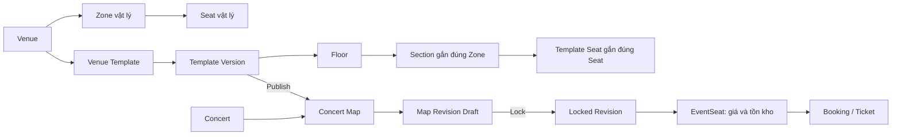
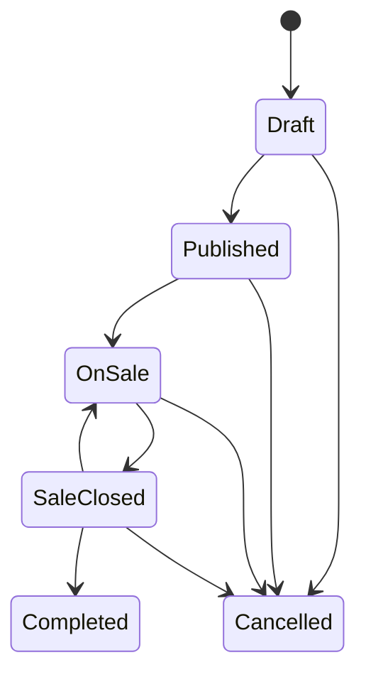

# StagePass

StagePass là hệ thống bán vé concert có chỗ ngồi. Một địa điểm được dựng thành
**venue template có phiên bản**; mỗi concert chụp một bản sao bất biến của
template đó trước khi mở bán. Khách hàng luôn chọn vé trên chính sơ đồ đã bị
khóa của concert, thay vì trên một danh sách ghế rời rạc.

Tài liệu này mô tả hành vi **đang có trong source**. Thiết kế dữ liệu và lý do
của các ràng buộc map nằm trong
[docs/stagepass-architecture.md](docs/stagepass-architecture.md).

## Chạy hệ thống

Yêu cầu: SQL Server 2019+ (Express được), `sqlcmd`, .NET SDK 9 và Node.js 20+.
Lần đầu, chạy từ thư mục gốc:

```powershell
.\scripts\setup.ps1
```

Script deploy **database trống**, tạo cấu hình local cần thiết và build hai ứng
dụng. Database sau khi deploy chỉ có 4 Role, tài khoản `system` cho tiến trình
tự động và 4 khoá cấu hình hệ thống — không có venue, concert hay tài khoản
nghiệp vụ nào. Toàn bộ dữ liệu được tạo trên giao diện.

`setup.ps1` **không xoá database đang có**. Nếu database đã tồn tại lược đồ,
`deploy.ps1` dừng lại và nêu hai lựa chọn: đổi tên database, hoặc chạy
`.\scripts\setup.ps1 -ResetDatabase` để **xoá sạch rồi tạo lại**. Sau đó khởi
động hai tiến trình:

```powershell
# Terminal 1
cd backend\src\ConcertTicketing.API
dotnet run

# Terminal 2
cd frontend
npm run dev
```

Sau khi API sẵn sàng, tạo tài khoản Admin ban đầu:

```powershell
.\scripts\bootstrap-admin.ps1
```

Script sẽ hỏi **email** và **mật khẩu** (nhập ẩn). Hai giá trị này không có mặc
định và mật khẩu không được ghi ra file hay in ra màn hình.

Mở `http://localhost:5173`.

## Mô hình nghiệp vụ



Các thực thể có trách nhiệm riêng:

| Thực thể | Là nguồn sự thật cho |
|---|---|
| `Venue`, `Zone`, `Seat` | Địa điểm và ghế vật lý, tái sử dụng giữa nhiều concert. |
| `VenueTemplate` và `VenueTemplateVersion` | Bản vẽ có thể tái sử dụng của một venue. |
| `TemplateFloor`, `TemplateSection`, `TemplateSeat` | Hình học từng tầng, khu và ghế của một version. Một `TemplateSection` bắt buộc gắn với một `Zone`; `TemplateSeat` phải thuộc đúng Zone của section. |
| `ConcertMap` và `ConcertMapRevision` | Bản sao sơ đồ dành riêng cho một concert. Revision `Locked` là bản duy nhất được công khai. |
| `EventSeat` | Ghế được bán trong **một concert**: hạng vé, giá bán và trạng thái tồn kho. Đây là nguồn sự thật cho booking. |

Do đó sơ đồ không tự sinh ghế mới và `EventSeat` không thay thế `Seat`. Sơ đồ
chỉ đặt **ghế vật lý đã có** vào đúng vị trí; `EventSeat` gắn ghế đó với một
concert cụ thể để bán.

## Vai trò và phạm vi quyền

| Vai trò | Công việc | Phạm vi dữ liệu |
|---|---|---|
| Customer | Duyệt concert, chọn ghế, giữ chỗ, thanh toán, xem vé và yêu cầu hoàn tiền. | Booking và vé của chính mình. |
| Check-in Staff | Quét hoặc nhập mã vé ở cổng. | Chỉ concert được phân công. |
| Organizer | Tạo và vận hành concert: hạng vé, map concert, tồn kho, khuyến mãi, hoàn tiền, báo cáo. | Chỉ concert do mình sở hữu. |
| Admin | Quản trị hệ thống, venue vật lý, template, người dùng, audit và có thể vận hành concert. | Toàn hệ thống. |

Phân quyền không chỉ nằm ở menu. Repository, controller và stored procedure
đều kiểm tra quyền. Ví dụ Organizer chỉ lấy được published template version
của venue thuộc concert do mình sở hữu; không thể dùng ID để đọc hoặc khóa map
của concert khác.

## Quy trình Admin: dựng venue một lần

Admin thực hiện quy trình này khi thêm một venue mới, hoặc khi venue thay đổi
bố cục vật lý. Organizer không phải dựng lại cho từng concert.

### 1. Khai báo danh mục vật lý

Trong **Quản trị → Danh mục**, tạo theo thứ tự:

1. Nghệ sĩ.
2. Venue.
3. Zone thuộc venue. Với mô hình hiện tại, zone dùng cho khu có ghế.
4. Seat thuộc zone: đặt mã ghế, hàng và số ghế. Chức năng tạo hàng loạt nhận
   zone đã chọn; mã ghế chỉ cần duy nhất trong zone, nên cùng mã có thể tồn tại
   ở các zone khác nhau của cùng venue.

Seat là định danh vật lý, không chứa giá hoặc trạng thái bán vé của một event.
Không retire zone/seat đang còn được sử dụng cho inventory hợp lệ.

### 2. Tạo template và version Draft

Vào **Quản trị → Mẫu sơ đồ**:

1. Tạo `VenueTemplate` cho venue. Một venue có thể có nhiều template, ví dụ
   end-stage và in-the-round.
2. Tạo `VenueTemplateVersion` ở trạng thái `Draft`.
3. Tạo một hoặc nhiều `Floor`; mỗi floor có canvas riêng.
4. Thêm `TemplateObject` như sân khấu, lối đi hay nhãn chỉ dẫn.
5. Thêm `TemplateSection`: chọn **Zone vật lý** tương ứng rồi vẽ hình học của
   section trên floor.
6. Thêm `TemplateSeat`: chọn seat từ chính zone của section và định vị nó.

Server từ chối section nằm ngoài canvas, đè lên sân khấu hoặc section khác
trên cùng floor. Server cũng từ chối một zone được gắn vào nhiều section trong
cùng version, hay một ghế không thuộc zone của section. Đây là cách giữ liên
kết một-một giữa sơ đồ và cơ sở vật lý.

Hình học hiện hỗ trợ `rect` và polygon lồi. Nhờ polygon, sơ đồ có thể thể hiện
khán đài nghiêng, lối đi, sân khấu và các cạnh không vuông. Bản hiện tại chưa
nhận trực tiếp CAD/PDF/DWG, chưa hỗ trợ đường cong Bézier, polygon lõm hoặc vé
đứng theo sức chứa (General Admission). Nếu venue gửi floor plan, nhân viên
vận hành dùng nó làm tài liệu tham chiếu để dựng template, không phải file mà
hệ thống tự hiểu và tự chuyển thành ghế.

### 3. Publish template version

Khi bản vẽ đã được kiểm tra, publish version. Version `Published` bất biến;
muốn sửa phải tạo Draft version khác. Điều này bảo toàn lịch sử layout đã dùng
để dựng concert.

## Quy trình Organizer hoặc Admin: tạo concert và mở bán

Quy trình dưới đây là con đường duy nhất để concert có sơ đồ bán vé. Không có
fallback sang danh sách zone/seat cũ cho khách hàng.

### 1. Tạo concert Draft

Trong **Quản trị → Concert**:

1. Chọn venue, một hoặc nhiều nghệ sĩ, thời gian diễn, cửa sổ bán và giới hạn
   vé mỗi khách.
2. Concert được tạo ở `Draft`.
3. Tạo các `TicketCategory` đang `Active` với giá cơ sở.
4. Cấu hình Fair Access, Waitlist, chính sách hủy và hoàn tiền nếu cần.

Nghệ sĩ được chọn nhiều người trong cùng một concert và được lưu theo thứ tự
hiển thị. Chỉ thay danh sách nghệ sĩ khi người vận hành thực sự thêm, bỏ hoặc
đổi thứ tự.

### 2. Chụp map revision từ template

Ở khối **Sơ đồ ghế StagePass (ConcertMap)** của concert:

1. Tạo `ConcertMap`. Concert phải còn `Draft` hoặc `Published` và chưa có
   EventSeat cũ.
2. Chọn một template version `Published` của **đúng venue** rồi tạo revision
   `Draft`. Hệ thống chụp floor, object, section và seat vào revision, nên sửa
   template sau đó không làm thay đổi concert này.
3. Kiểm tra revision và bấm **Khóa (Lock)**.

Lock chỉ thành công khi revision có ít nhất một floor, section và seat. Một
concert chỉ có một locked revision; không thể thay nó sau này. Map hoặc revision
cũng không tạo/khóa được sau khi concert đã `OnSale`.

### 3. Tạo inventory từ locked revision

Trong khối của revision đã khóa, chọn hạng vé Active và các map seat cần bán.
Hệ thống gọi `sp_AddEventSeatsFromMapRevision` để tạo `EventSeat` và ghi liên
kết ngược vào `ConcertMapRevisionSeat`.

Đây là bước gắn giá và tồn kho vào ghế. Nó bảo đảm:

- Map seat phải thuộc đúng locked revision của concert.
- Seat và zone vật lý chưa bị `Retired`.
- Một seat chỉ có một `EventSeat` trong cùng concert.
- Mọi EventSeat của concert đều nằm trong locked revision.

`sp_AddEventSeats` dạng thô bị từ chối khi concert đã có `ConcertMap`, nhằm
tránh hai nguồn inventory cho cùng một concert.

### 4. Chuyển trạng thái concert

Luồng chính là:



Trước khi `Published → OnSale`, database bắt buộc có EventSeat, `ConcertMap`,
một locked revision, cửa sổ mở/đóng bán và liên kết map-seat/EventSeat nhất
quán. Các điều kiện này không chỉ là cảnh báo giao diện.

`Cancelled` xử lý việc hủy concert theo transaction: đóng queue/waitlist, hủy
booking và ticket còn hiệu lực, giải phóng allocation/inventory, rồi tạo các
yêu cầu refund cần thiết. Xác nhận refund vẫn là bước riêng sau khi khoản tiền
được hoàn thực tế.

## Trải nghiệm Customer: chọn ghế từ sơ đồ

Trang concert chỉ cho chọn vé khi concert ở `OnSale`, không tạm dừng bán và
khách đáp ứng điều kiện Fair Access nếu concert bật tính năng đó.

1. **Map tổng quan:** khách nhìn toàn bộ floor plan đã khóa, các section được
   tô theo hạng/giá và trạng thái còn chỗ.
2. **Map chi tiết:** bấm một section để đi vào các ghế thật của section đó,
   gồm trạng thái khả dụng, đang giữ, đã bán hoặc không khả dụng. Khách chọn
   EventSeat, không chọn một `Seat` vật lý chưa có inventory.
3. **Minimap và Home:** khách có thể cuộn để phóng to, kéo để lia và bấm minimap
   để di chuyển trên floor lớn. Nút Home/Về toàn cảnh trở về map tổng quan và
   căn giữa sơ đồ; không có nút phóng to/thu nhỏ `+`/`−`.
4. **Giữ chỗ và thanh toán:** tạo booking `Pending` với thời hạn giữ chỗ, sau
   đó thanh toán. Một ghế cạnh tranh đồng thời chỉ được giữ bởi một người.
5. **Vé:** thanh toán thành công phát ticket và QR; khách xem lại trong
   **Vé của tôi**.

Nếu concert chưa có locked revision, trang hiển thị trạng thái sơ đồ đang được
hoàn thiện và không hiển thị danh sách ghế thay thế. Như vậy khách không thể mua
một EventSeat mà không thấy đúng vị trí của nó trên map.

## Các nghiệp vụ vận hành khác

### Khuyến mãi và mã giảm giá

Trong **Quản trị → Khuyến mãi**, tạo promotion gắn với concert, cấu hình kiểu
giảm, thời gian hiệu lực, giới hạn và yêu cầu mã. Promotion phải `Active` mới
được áp dụng. Mã giảm giá thuộc promotion, có giới hạn tổng lượt dùng và lượt
dùng mỗi khách; có thể tắt riêng mã bị lộ mà không cần tắt cả promotion.

### Fair Access và Waitlist

Fair Access điều tiết lượt vào trang chọn ghế. Waitlist cấp cơ hội mua cho khách
chờ khi có ghế trả lại. Đây là hai luồng riêng: queue kiểm soát quyền truy cập
chọn ghế, còn waitlist xử lý cơ hội sau khi hết inventory.

### Hoàn tiền

Khách hủy vé theo chính sách concert để tạo yêu cầu refund. Admin hoặc Organizer
xem và xác nhận refund trong **Quản trị → Hoàn tiền** sau khi khoản hoàn đã được
xử lý qua phương thức thanh toán. Không đánh dấu đã hoàn chỉ vì yêu cầu vừa được
tạo.

### Báo cáo và audit

**Quản trị → Báo cáo** tổng hợp dữ liệu vận hành theo quyền truy cập. **Audit**
lưu các thay đổi quan trọng như tạo/lần publish template, tạo/khóa revision,
tạo inventory và chuyển trạng thái concert. Mục Audit chỉ dành cho Admin.

### Soát vé

Admin cấp vai trò Check-in Staff và phân công nhân viên cho concert. Nhân viên
vào `/checkin` để quét/nhập mã. Ticket hợp lệ chỉ check-in một lần; ticket đã
dùng, bị hủy hay không thuộc concert được phân công sẽ bị từ chối.

## Ràng buộc cần biết trước khi vận hành

| Tình huống | Hành vi hệ thống |
|---|---|
| Cần chỉnh layout đã publish | Tạo template version Draft mới, chỉnh và publish; không sửa version cũ. |
| Cần chỉnh map của concert đã lock | Không thay locked revision. Tạo lại concert khi cần thay đổi layout trước khi có bán vé. |
| Cần thêm ghế bán cho concert có map | Chọn map seat trong locked revision; không thêm EventSeat bằng danh sách SeatID thô. |
| Cần cùng mã ghế ở zone khác | Được phép; mã ghế có phạm vi zone. |
| Cần venue mới | Admin tạo venue, zone, seat và template mới; không tái dùng template của venue khác. |
| Cần biểu diễn ghế đứng/đường cong phức tạp | Chưa thuộc mô hình hiện tại; cần mở rộng data model và renderer, không nên giả lập bằng seat hoặc polygon sai nghĩa. |

## Kiểm thử

```powershell
# Backend
dotnet test backend\tests\ConcertTicketing.UnitTests
dotnet test backend\tests\ConcertTicketing.IntegrationTests

# Frontend
cd frontend
npm test

# Database — BẮT BUỘC chạy trên database kiểm thử RIÊNG
cd database\Tests
.\Run-All-Tests.ps1 -Database ConcertTicketingDB_Test
```

Bộ test database **thay thế toàn bộ dữ liệu của database đích**: `01_SetupMockData.sql`
xoá hết tài khoản ngoài `system`, vì các test về "Admin Active cuối cùng" (58406) đòi
hỏi hệ thống có **đúng một** Admin. Script tự dừng nếu database đích còn tài khoản thật
(`-Force` để bỏ qua). Cuối mỗi lần chạy, `Teardown-MockData.sql` đưa database về đúng
trạng thái sau deploy — 4 Role và tài khoản `system`, không còn dữ liệu nghiệp vụ.
## Cấu trúc repository

| Thư mục | Nội dung |
|---|---|
| `database/` | Tables, stored procedures, functions, views, quyền SQL, deploy scripts và database tests. |
| `backend/src/` | ASP.NET API, application DTO/interface, domain và repository truy cập SQL. |
| `frontend/src/` | React UI: mua vé, map khách hàng, khu quản trị và check-in. |
| `scripts/` | Thiết lập hệ thống (deploy database trống + cấu hình local) và bootstrap tài khoản Admin. |
| `docs/` | Tài liệu thiết kế, kế hoạch và hướng dẫn kỹ thuật. |

## Tài liệu liên quan

| Tài liệu | Khi cần xem |
|---|---|
| [Kiến trúc StagePass](docs/stagepass-architecture.md) | Thiết kế venue template, revision và customer map. |
| [Hướng dẫn sử dụng cho Admin](docs/admin-guide.md) | Toàn bộ chức năng Admin: danh mục, mẫu sơ đồ, người dùng, sơ đồ concert, khuyến mãi, báo cáo, audit và bảng mã lỗi. |
| [Hướng dẫn thiết lập phát triển](docs/developer_setup_guide.md) | Môi trường phát triển và kiểm tra cục bộ. |
