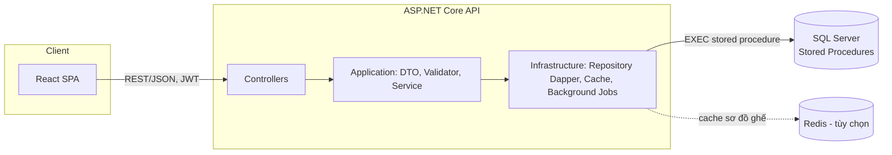
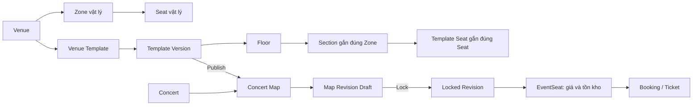
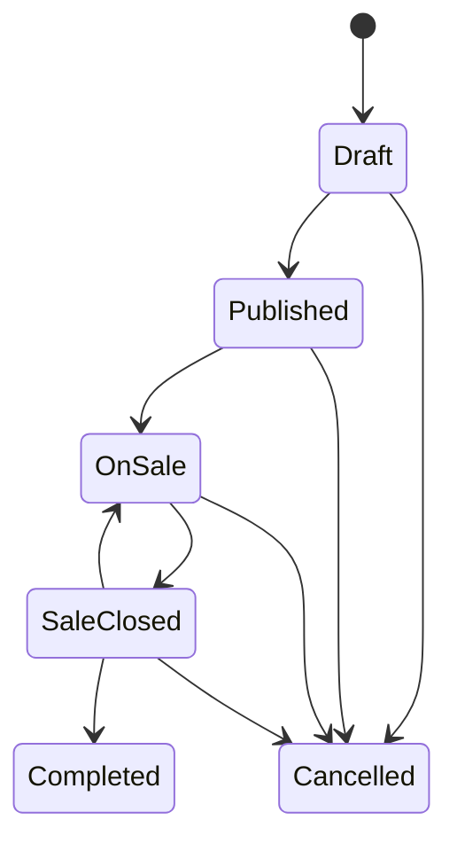

# StagePass - Hệ thống bán vé concert có sơ đồ chỗ ngồi

StagePass là hệ thống bán vé concert có chỗ ngồi thật (không phải danh sách vé
rời rạc). Một địa điểm được dựng thành **venue template có phiên bản**; mỗi
concert chụp một bản sao bất biến của template đó trước khi mở bán, rồi bán vé
trực tiếp trên chính sơ đồ đã bị khóa của concert.

Ba tầng đối tượng của bài toán được tách rõ và không nhầm lẫn:

- **Vật lý** (`Venue`/`Zone`/`Seat`) — tồn tại độc lập, tái sử dụng qua nhiều concert.
- **Bản vẽ** (`VenueTemplate`/`VenueTemplateVersion`) — cách bố trí một venue, có thể tái bản.
- **Sự kiện** (`ConcertMap`/`ConcertMapRevision`/`EventSeat`) — bản chụp bất biến gắn giá và tồn kho cho MỘT concert cụ thể.

Toàn bộ nghiệp vụ ghi (đặt vé, thanh toán, hoàn tiền, check-in, quản trị) được
thực thi qua **stored procedure** trong SQL Server, không phải logic ORM ở tầng
ứng dụng — tầng API chỉ điều phối và không được phép ghi trực tiếp vào các
bảng nghiệp vụ (quyền SQL chặn cứng điều này, xem [Bảo mật](#bảo-mật--đặc-quyền-tối-thiểu)).

## Mục lục

- [Công nghệ](#công-nghệ)
- [Kiến trúc](#kiến-trúc)
- [Mô hình nghiệp vụ (StagePass)](#mô-hình-nghiệp-vụ-stagepass)
- [Vai trò và phạm vi quyền](#vai-trò-và-phạm-vi-quyền)
- [Yêu cầu hệ thống](#yêu-cầu-hệ-thống)
- [Cài đặt lần đầu](#cài-đặt-lần-đầu)
- [Cấu hình](#cấu-hình)
- [Chạy trong quá trình phát triển](#chạy-trong-quá-trình-phát-triển)
- [Kiểm thử](#kiểm-thử)
- [Bảo mật & đặc quyền tối thiểu](#bảo-mật--đặc-quyền-tối-thiểu)
- [Vận hành: background job, health check, log](#vận-hành-background-job-health-check-log)
- [Cổng thanh toán](#cổng-thanh-toán)
- [Quy trình nghiệp vụ chính](#quy-trình-nghiệp-vụ-chính)
- [Ràng buộc cần biết trước khi vận hành](#ràng-buộc-cần-biết-trước-khi-vận-hành)
- [Cấu trúc repository](#cấu-trúc-repository)

## Công nghệ

| Lớp | Công nghệ | Ghi chú |
|---|---|---|
| Backend | ASP.NET Core 9 (Web API), C# | Clean Architecture: API → Application → Infrastructure → Domain |
| Truy cập dữ liệu | Dapper 2 + `Microsoft.Data.SqlClient` | Không dùng ORM/migration tự sinh — mọi câu ghi đi qua stored procedure thủ công |
| Cơ sở dữ liệu | SQL Server 2019+ (khuyến nghị 2022), collation `Vietnamese_CI_AS` | 41 bảng, 62 stored procedure, 34 trigger, 17 view, 7 hàm — xem [database/](database/) |
| Xác thực | JWT Bearer (access token) + Refresh Token qua **HttpOnly Cookie** | Access token ngắn hạn trong body response; refresh token không lộ cho JavaScript (chống XSS) |
| Cache | Redis (`StackExchange.Redis`) | **Tùy chọn khi chạy dev**: cache sơ đồ ghế; hệ thống tự chịu lỗi và đọc thẳng DB nếu Redis không sẵn sàng |
| Background job | Hangfire (lưu trữ trên chính SQL Server) | Dùng cho job email/cần retry + persistence |
| Worker định kỳ | `IHostedService` riêng cho từng job hệ thống (SIP1/2/3/5) | Không dùng Hangfire cho các job này vì đã idempotent, không cần retry phức tạp |
| Rate limiting | ASP.NET Core `RateLimiter` built-in | Theo UserID (đăng nhập) hoặc IP (chưa đăng nhập), xem bảng chi tiết bên dưới |
| Logging | Serilog (Console + File, xoay vòng theo ngày) | |
| API docs (dev only) | OpenAPI + Scalar UI tại `/scalar` | Không bật ở Production |
| Frontend | React 19 + React Router 7 + Vite 8 | Không TypeScript; JavaScript thuần (`.jsx`) |
| HTTP client / khác | Axios, `qrcode` (sinh QR vé) | |
| Lint | `oxlint` (frontend) | |
| Test | xUnit (backend), `node --test` (frontend), bộ T-SQL tự viết (database) | Xem [Kiểm thử](#kiểm-thử) |

## Kiến trúc



Nguyên tắc phân lớp: `Domain` không phụ thuộc gì; `Application` định nghĩa
interface/DTO/validator, không biết SQL; `Infrastructure` hiện thực repository
bằng Dapper và luôn set `SESSION_CONTEXT('UserID')` trên mỗi kết nối trước câu
lệnh đầu tiên — điều kiện bắt buộc để các view row-level-security và trigger
audit hoạt động đúng (xem [Bảo mật](#bảo-mật--đặc-quyền-tối-thiểu)); `API` chỉ
điều phối HTTP, xác thực, phân quyền và middleware.

## Mô hình nghiệp vụ (StagePass)



Các thực thể có trách nhiệm riêng:

| Thực thể | Là nguồn sự thật cho |
|---|---|
| `Venue`, `Zone`, `Seat` | Địa điểm và ghế vật lý, tái sử dụng giữa nhiều concert. |
| `VenueTemplate` và `VenueTemplateVersion` | Bản vẽ có thể tái sử dụng của một venue. |
| `TemplateFloor`, `TemplateSection`, `TemplateSeat` | Hình học từng tầng, khu và ghế của một version. Một `TemplateSection` bắt buộc gắn với một `Zone`; `TemplateSeat` phải thuộc đúng Zone của section. |
| `ConcertMap` và `ConcertMapRevision` | Bản sao sơ đồ dành riêng cho một concert. Revision `Locked` là bản duy nhất được công khai. |
| `EventSeat` | Ghế được bán trong **một concert**: hạng vé, giá bán và trạng thái tồn kho. Đây là nguồn sự thật cho booking. |

Do đó sơ đồ không tự sinh ghế mới và `EventSeat` không thay thế `Seat`. Sơ đồ
chỉ đặt **ghế vật lý đã có** vào đúng vị trí; `EventSeat` gắn ghế đó với một
concert cụ thể để bán.

## Vai trò và phạm vi quyền

| Vai trò | Công việc | Phạm vi dữ liệu |
|---|---|---|
| Customer | Duyệt concert, chọn ghế, giữ chỗ, thanh toán, xem vé và yêu cầu hoàn tiền. | Booking và vé của chính mình. |
| Check-in Staff | Quét hoặc nhập mã vé ở cổng. | Chỉ concert được phân công. |
| Organizer | Tạo và vận hành concert: hạng vé, map concert, tồn kho, khuyến mãi, hoàn tiền, báo cáo. | Chỉ concert do mình sở hữu. |
| Admin | Quản trị hệ thống, venue vật lý, template, người dùng, audit và có thể vận hành concert. | Toàn hệ thống. |

Phân quyền được thực thi ở **ba lớp độc lập**, không chỉ ở menu giao diện:

1. **Controller** (`[Authorize(Roles = "...")]`) — chặn theo vai trò ở tầng HTTP.
2. **Repository/stored procedure** — kiểm tra lại quyền sở hữu bằng dữ liệu thật
   (ví dụ Organizer chỉ lấy được template version của venue thuộc concert do
   chính mình sở hữu; không thể dùng ID để đọc hoặc khóa map của concert khác).
3. **Quyền SQL Server** — 5 SQL login riêng biệt theo nguyên tắc đặc quyền tối
   thiểu, độc lập với vai trò ứng dụng (xem [Bảo mật](#bảo-mật--đặc-quyền-tối-thiểu)).

## Yêu cầu hệ thống

| Công cụ | Phiên bản tối thiểu | Bắt buộc? |
|---|---|---|
| SQL Server | 2019+ (khuyến nghị 2022, Express đủ dùng) | Bắt buộc |
| `sqlcmd` | Đi kèm SQL Server Command Line Utilities | Bắt buộc (script deploy dùng trực tiếp) |
| .NET SDK | 9.0 | Bắt buộc |
| Node.js | 20+ | Bắt buộc |
| Redis | Bất kỳ bản còn hỗ trợ | Tùy chọn — hệ thống tự phát hiện Redis không chạy và đọc thẳng DB, không sập |

## Cài đặt lần đầu

Chạy từ thư mục gốc:

```powershell
.\scripts\setup.ps1
```

Script thực hiện tuần tự:

1. Kiểm tra công cụ bắt buộc (`sqlcmd`, `dotnet`, `npm`) và dò Redis (không bắt buộc phải chạy).
2. Deploy **database trống**: chỉ 4 Role, tài khoản `system` (dùng cho tiến
   trình tự động) và 4 khóa `SystemConfiguration` — không có venue, concert
   hay tài khoản nghiệp vụ nào. `deploy.ps1` sinh mật khẩu ngẫu nhiên cho 5 SQL
   login và ghi ra `.deploy/db-credentials.json` (nằm trong `.gitignore`).
3. Sinh `Jwt:Secret` và `PaymentSignature:Secret` ngẫu nhiên (256-bit), ghi vào
   `backend/src/ConcertTicketing.API/appsettings.Local.json` — file này nằm
   trong `.gitignore`, **không bao giờ được commit**.
4. Ghi `frontend/.env` để Vite proxy `/api` tới backend.
5. Build backend và frontend.

**Không có bí mật nào nằm sẵn trong repository.** Mỗi lần chạy `setup.ps1`
trên một máy mới sinh ra một bộ khóa hoàn toàn mới.

`setup.ps1` **không tự xóa database đang có**. Nếu database đã tồn tại lược đồ
(có bảng `UserAccount`), `deploy.ps1` dừng lại ngay và nêu rõ hai lựa chọn:
đổi tên database (`-DatabaseName`), hoặc chạy
`.\scripts\setup.ps1 -ResetDatabase` để **xóa sạch dữ liệu hiện có rồi tạo lại
từ đầu**.

Sau khi build xong, khởi động hai tiến trình ở hai terminal riêng:

```powershell
# Terminal 1 — Backend (mặc định http://localhost:5295, https://localhost:7188)
cd backend\src\ConcertTicketing.API
dotnet run

# Terminal 2 — Frontend (http://localhost:5173)
cd frontend
npm run dev
```

Sau khi API đã chạy (bắt buộc theo đúng thứ tự này — script cần gọi API để
đăng ký tài khoản), tạo tài khoản Admin đầu tiên:

```powershell
.\scripts\bootstrap-admin.ps1
```

Script hỏi **email** và **mật khẩu** (nhập ẩn bằng `Read-Host -AsSecureString`).
Hai giá trị này không có mặc định, và mật khẩu không được ghi ra file hay in ra
màn hình — vì đây là bài toán "con gà quả trứng": `sp_AssignRole` yêu cầu người
gọi đã là Admin, nhưng Admin đầu tiên chưa tồn tại, nên đây là **nơi duy nhất
trong toàn hệ thống** ghi thẳng vào `UserRoleAssignment` bằng `sqlcmd` thay vì
qua API.

Mở `http://localhost:5173`.

## Cấu hình

Cấu hình đọc theo thứ tự ưu tiên: **biến môi trường > `appsettings.Local.json`
> `appsettings.{Environment}.json` > `appsettings.json`**. File
`appsettings.json` trong repository **không chứa bí mật nào** (mọi giá trị
nhạy cảm để rỗng); giá trị thật đến từ `appsettings.Local.json` (dev, do
`setup.ps1` sinh, nằm trong `.gitignore`) hoặc biến môi trường (triển khai
thật). Tiến trình **từ chối khởi động** (ném lỗi ngay, không chạy lỗi ngầm) nếu
thiếu bất kỳ khóa bắt buộc nào dưới đây.

| Khóa | Bắt buộc | Mặc định trong repo | Ghi chú |
|---|---|---|---|
| `ConnectionStrings:Default` | Có | *(rỗng)* | Chuỗi kết nối SQL Server dùng login `api_service` |
| `Jwt:Secret` | Có, ≥ 32 ký tự | *(rỗng)* | Khóa HMAC-SHA256 (256-bit), ký access token |
| `Jwt:Issuer` / `Jwt:Audience` | Có | `ConcertTicketingAPI` / `ConcertTicketingClients` | |
| `Jwt:AccessTokenExpiryMinutes` | Có, số nguyên ≥ 1 | `30` | |
| `Jwt:RefreshTokenExpiryDays` | Có, số nguyên ≥ 1 | `7` | |
| `PaymentSignature:Secret` | Có, ≥ 32 ký tự | *(rỗng)* | Khóa HMAC-SHA256 xác minh callback thanh toán — điều duy nhất chặn người ngoài tự gọi webhook "thanh toán thành công" |
| `Cors:AllowedOrigins` | Có, mảng không rỗng | `["http://localhost:5173", "http://127.0.0.1:5173"]` | Domain frontend được phép gọi API kèm cookie |
| `Redis:ConnectionString` | Có (giá trị, không cần Redis đang chạy) | `localhost:6379` | Kết nối lười; nếu Redis không phản hồi, cache tự tắt, hệ thống đọc thẳng DB |
| `Redis:SeatMapTtlSeconds` | Không | `15` | Thời gian sống của cache sơ đồ ghế |
| `PaymentGateway:Mode` | Có, `Simulator` hoặc `External` | `Simulator` | Xem [Cổng thanh toán](#cổng-thanh-toán) |
| `PaymentGateway:SimulatorReturnUrl` | Có nếu `Mode=Simulator` | URL simulator frontend | |
| `PaymentGateway:ExternalPaymentUrl` | Có nếu `Mode=External` | Sandbox VNPay (placeholder) | Chưa tích hợp PSP thật, xem ghi chú bên dưới |
| `Hangfire:DashboardPath` | Không | `/hangfire` | |
| `AllowedHosts` | Có | `localhost;127.0.0.1` | |

Muốn ghi đè bằng biến môi trường, dùng cú pháp chuẩn ASP.NET Core
(`Jwt__Secret`, `ConnectionStrings__Default`, ...) hoặc tiền tố riêng
`CONCERT_` (ví dụ `CONCERT_Jwt__Secret`) — cả hai đều được nạp, và **biến môi
trường luôn thắng file**, kể cả khi file được nạp sau, để tránh tình huống một
`appsettings.Local.json` cũ còn sót trên máy âm thầm ghi đè cấu hình triển
khai thật.

Frontend chỉ có một biến cấu hình public: `VITE_API_BASE_URL` (mặc định
`http://localhost:5295/api`, xem `frontend/.env.example`). Mọi biến tiền tố
`VITE_` đều nằm trong bundle JavaScript gửi cho trình duyệt — tuyệt đối không
đặt bí mật ở đây.

## Chạy trong quá trình phát triển

| Thành phần | Địa chỉ mặc định |
|---|---|
| Frontend (Vite dev server) | `http://localhost:5173` |
| Backend API (HTTP) | `http://localhost:5295` |
| Backend API (HTTPS) | `https://localhost:7188` |
| API docs tương tác (Scalar, chỉ Development) | `http://localhost:5295/scalar` |
| Hangfire Dashboard (chỉ Admin đã đăng nhập) | `http://localhost:5295/hangfire` |
| Health check | `http://localhost:5295/healthz` |

Vite dev server proxy `/api/*` sang backend (`vite.config.js`), nên frontend
gọi API bằng đường dẫn tương đối trong môi trường phát triển. Muốn truy cập từ
thiết bị khác trong cùng mạng LAN (demo trên điện thoại, máy khác), dùng
`npm run dev:lan` (frontend) và profile `lan` của backend
(`dotnet run --launch-profile lan`).

## Kiểm thử

```powershell
# Backend — 14 test class (Unit) + 12 test class (Integration)
dotnet test backend\tests\ConcertTicketing.UnitTests
dotnet test backend\tests\ConcertTicketing.IntegrationTests

# Frontend — chạy bằng node --test, không cần framework ngoài
cd frontend
npm test

# Database — BẮT BUỘC chạy trên database kiểm thử RIÊNG, không phải database vận hành
cd database\Tests
.\Run-All-Tests.ps1 -Database ConcertTicketingDB_Test
```

Bộ test database gồm hơn 360 assertion T-SQL (tự viết, không dùng tSQLt) cộng
hai bài kiểm tra tương tranh thật bằng nhiều kết nối song song
(`11_Test_Concurrency.ps1` cho oversell, `14_Test_VenueMap_Concurrency.ps1`
cho race điều kiện khi cấu hình sơ đồ venue). Bộ test **thay thế toàn bộ dữ
liệu của database đích**: `01_SetupMockData.sql` xóa hết tài khoản ngoài
`system`, vì các test về "Admin Active cuối cùng" đòi hỏi hệ thống có **đúng
một** Admin tại thời điểm test. Script tự dừng và từ chối chạy nếu database
đích còn tài khoản thật (dùng `-Force` để bỏ qua cảnh báo này khi thực sự có
ý định đó). Cuối mỗi lần chạy, `Teardown-MockData.sql` đưa database về đúng
trạng thái sau deploy — 4 Role và tài khoản `system`, không còn dữ liệu
nghiệp vụ nào.

## Bảo mật & đặc quyền tối thiểu

- **Xác thực:** JWT access token (mặc định 30 phút) trả trong response body;
  refresh token (mặc định 7 ngày) lưu trong cookie `HttpOnly` + `SameSite`,
  JavaScript của trang không đọc được — giảm bề mặt tấn công XSS đánh cắp
  phiên đăng nhập dài hạn.
- **RBAC ba lớp:** controller → repository/stored procedure → quyền SQL Server
  (mục [Vai trò và phạm vi quyền](#vai-trò-và-phạm-vi-quyền)).
- **5 SQL Server login riêng theo nguyên tắc đặc quyền tối thiểu**
  (`api_service`, `app_admin`, `app_organizer`, `app_customer`,
  `app_checkinstaff`), mỗi login chỉ được `GRANT`/`DENY` đúng bảng cần thiết
  cho vai trò đó ở tầng SQL — độc lập với kiểm tra ở tầng ứng dụng. Ví dụ
  `app_customer` bị `DENY SELECT` trên `Payment`, `Ticket`, `AuditRecord` dù
  ứng dụng có lỗi lập trình cũng không đọc được các bảng đó qua login này.
  Xem [database/Security/](database/Security/).
- **Row-Level Security qua `SESSION_CONTEXT`:** các view báo cáo nhạy cảm
  (doanh thu, danh sách khách tham dự...) tự lọc theo
  `SESSION_CONTEXT('UserID')` do tầng Infrastructure set trên mỗi kết nối —
  một Organizer không thể đọc dữ liệu của Organizer khác dù có quyền `SELECT`
  trên view đó.
- **AuditRecord bất biến:** trigger chặn cứng mọi `UPDATE`/`DELETE` trên bảng
  audit; một trigger khác đối chiếu `ActorUserID` ghi vào audit phải khớp
  đúng `SESSION_CONTEXT('UserID')` của phiên đang gọi (chống giả mạo actor).
- **Rate limiting** (ASP.NET Core `RateLimiter`, áp dụng sau `Authentication`
  để phân vùng theo UserID khi đã đăng nhập):

  | Policy | Giới hạn | Phân vùng theo | Mục đích |
  |---|---|---|---|
  | `auth` | 5 request/phút | IP | Chống brute-force đăng nhập |
  | `booking` | 2 request/10 giây | UserID | Chống double-click khi đặt vé |
  | `checkin` | 100 request/phút | UserID (nhân viên) | Giới hạn thao tác check-in thật |
  | `checkin-preview` | 100 request/phút | UserID (nhân viên) | Ngân sách **riêng** cho tra cứu trước khi check-in, không trừ vào ngân sách check-in thật |

- **Middleware pipeline theo đúng thứ tự bắt buộc:** forwarded headers (sau
  reverse proxy) → request logging → error handling tập trung → HTTPS
  redirect (production) → CORS → routing → authentication → authorization →
  rate limiter → controllers. Sai thứ tự này (đặc biệt rate limiter theo
  UserID trước authentication) làm chức năng phân vùng theo người dùng mất
  tác dụng.
- Toàn bộ mã nguồn **không dùng `NOLOCK`/`READ UNCOMMITTED`** ở bất kỳ đâu
  trong tầng database, tránh lớp lỗi dirty read (đã kiểm chứng bằng thực
  nghiệm, xem [scripts/loi-02-dirty-read.sql](scripts/loi-02-dirty-read.sql)).

## Vận hành: background job, health check, log

| Job | Chạy bằng | Vai trò |
|---|---|---|
| Nhả hold hết hạn + cấp cơ hội Waitlist ngay sau đó (SIP1 + SIP2) | `HoldReleaseWorker` (`IHostedService`) | Định kỳ; gọi `sp_ReleaseExpiredHolds` rồi `sp_AllocateWaitlist` |
| Admission hàng đợi Fair Access (SIP3) | `QueueAdmissionWorker` (`IHostedService`) | Định kỳ; gọi `sp_ProcessQueueAdmission` |
| Tự động mở/đóng cửa sổ bán vé theo lịch (SIP5) | `SaleWindowWorker` (`IHostedService`) | Định kỳ; gọi `sp_ProcessSaleWindowTransitions` |
| Cascade hủy concert (SIP4) | Đồng bộ, ngay trong `sp_UpdateConcertStatus` | Không cần worker riêng — chạy trong cùng transaction hủy |
| Job cần retry + lưu trạng thái (ví dụ email) | Hangfire (lưu trên SQL Server), xem `/hangfire` | Dashboard chỉ Admin đã đăng nhập mới xem được |

Ba worker định kỳ dùng `IHostedService` thay vì Hangfire vì mọi stored
procedure đích đều **idempotent** (gọi lại nhiều lần không gây sai lệch),
không cần cơ chế retry/persistence phức tạp của Hangfire. Cả ba worker chạy
ngoài một HTTP request nên dùng kết nối `OpenForSystemAsync` — ghi
`ActorUserID` là tài khoản `system` trong mọi `AuditRecord` chúng tạo ra.

Log ghi đồng thời ra Console và file `logs/concert-api-{ngày}.log` (Serilog,
xoay vòng theo ngày, thư mục `logs/` nằm trong `.gitignore`). Health check tại
`/healthz` kiểm tra cả kết nối SQL Server và Redis.

## Cổng thanh toán

Hệ thống **chưa tích hợp cổng thanh toán thật** (PSP). `PaymentGateway:Mode`
có hai giá trị:

- `Simulator` (mặc định dev): bộ mô phỏng chạy trong chính backend
  (`PaymentSimulatorController`). Đây **không phải** đường tắt bỏ qua kiểm
  tra — nó đóng đúng vai trò một cổng thanh toán bên ngoài: tự tính chữ ký
  HMAC-SHA256 bằng `PaymentSignature:Secret` rồi gọi vào đúng luồng xác nhận
  thật (`sp_ConfirmPayment`), nên demo vẫn đi qua toàn bộ mã kiểm tra chữ ký
  như khi tích hợp PSP thật.
- `External`: trỏ tới URL cổng thanh toán thật (giá trị mặc định trong repo
  là sandbox VNPay, chỉ mang tính minh họa vị trí cắm vào, **chưa được tích
  hợp đầy đủ** — tích hợp PSP thật đòi hỏi bổ sung xử lý callback riêng của
  PSP đó).

Tiến trình **từ chối khởi động** nếu `PaymentGateway:Mode = Simulator` trong
khi `ASPNETCORE_ENVIRONMENT = Production` — cho phép "thanh toán" không có
tiền thật đi kèm là điều tuyệt đối không được phép xuất hiện ngoài môi trường
demo/thử nghiệm.

## Quy trình nghiệp vụ chính

### Quy trình Admin: dựng venue một lần

Admin thực hiện quy trình này khi thêm một venue mới, hoặc khi venue thay đổi
bố cục vật lý. Organizer không phải dựng lại cho từng concert.

#### 1. Khai báo danh mục vật lý

Trong **Quản trị → Danh mục**, tạo theo thứ tự:

1. Nghệ sĩ.
2. Venue.
3. Zone thuộc venue. Với mô hình hiện tại, zone dùng cho khu có ghế.
4. Seat thuộc zone: đặt mã ghế, hàng và số ghế. Chức năng tạo hàng loạt nhận
   zone đã chọn; mã ghế chỉ cần duy nhất trong zone, nên cùng mã có thể tồn tại
   ở các zone khác nhau của cùng venue.

Seat là định danh vật lý, không chứa giá hoặc trạng thái bán vé của một event.
Không retire zone/seat đang còn được sử dụng cho inventory hợp lệ.

#### 2. Tạo template và version Draft

Vào **Quản trị → Mẫu sơ đồ**:

1. Tạo `VenueTemplate` cho venue. Một venue có thể có nhiều template, ví dụ
   end-stage và in-the-round.
2. Tạo `VenueTemplateVersion` ở trạng thái `Draft`.
3. Tạo một hoặc nhiều `Floor`; mỗi floor có canvas riêng.
4. Thêm `TemplateObject` như sân khấu, lối đi hay nhãn chỉ dẫn.
5. Thêm `TemplateSection`: chọn **Zone vật lý** tương ứng rồi vẽ hình học của
   section trên floor.
6. Thêm `TemplateSeat`: chọn seat từ chính zone của section và định vị nó.

Server từ chối section nằm ngoài canvas, đè lên sân khấu hoặc section khác
trên cùng floor. Server cũng từ chối một zone được gắn vào nhiều section trong
cùng version, hay một ghế không thuộc zone của section. Đây là cách giữ liên
kết một-một giữa sơ đồ và cơ sở vật lý.

Hình học hiện hỗ trợ `rect` và polygon lồi. Nhờ polygon, sơ đồ có thể thể hiện
khán đài nghiêng, lối đi, sân khấu và các cạnh không vuông. Bản hiện tại chưa
nhận trực tiếp CAD/PDF/DWG, chưa hỗ trợ đường cong Bézier, polygon lõm hoặc vé
đứng theo sức chứa (General Admission). Nếu venue gửi floor plan, nhân viên
vận hành dùng nó làm tài liệu tham chiếu để dựng template, không phải file mà
hệ thống tự hiểu và tự chuyển thành ghế.

#### 3. Publish template version

Khi bản vẽ đã được kiểm tra, publish version. Version `Published` bất biến;
muốn sửa phải tạo Draft version khác. Điều này bảo toàn lịch sử layout đã dùng
để dựng concert.

### Quy trình Organizer hoặc Admin: tạo concert và mở bán

Quy trình dưới đây là con đường duy nhất để concert có sơ đồ bán vé. Không có
fallback sang danh sách zone/seat cũ cho khách hàng.

#### 1. Tạo concert Draft

Trong **Quản trị → Concert**:

1. Chọn venue, một hoặc nhiều nghệ sĩ, thời gian diễn, cửa sổ bán và giới hạn
   vé mỗi khách.
2. Concert được tạo ở `Draft`.
3. Tạo các `TicketCategory` đang `Active` với giá cơ sở.
4. Cấu hình Fair Access, Waitlist, chính sách hủy và hoàn tiền nếu cần.

Nghệ sĩ được chọn nhiều người trong cùng một concert và được lưu theo thứ tự
hiển thị. Chỉ thay danh sách nghệ sĩ khi người vận hành thực sự thêm, bỏ hoặc
đổi thứ tự.

#### 2. Chụp map revision từ template

Ở khối **Sơ đồ ghế StagePass (ConcertMap)** của concert:

1. Tạo `ConcertMap`. Concert phải còn `Draft` hoặc `Published` và chưa có
   EventSeat cũ.
2. Chọn một template version `Published` của **đúng venue** rồi tạo revision
   `Draft`. Hệ thống chụp floor, object, section và seat vào revision, nên sửa
   template sau đó không làm thay đổi concert này.
3. Kiểm tra revision và bấm **Khóa (Lock)**.

Lock chỉ thành công khi revision có ít nhất một floor, section và seat. Một
concert chỉ có một locked revision; không thể thay nó sau này. Map hoặc revision
cũng không tạo/khóa được sau khi concert đã `OnSale`.

#### 3. Tạo inventory từ locked revision

Trong khối của revision đã khóa, chọn hạng vé Active và các map seat cần bán.
Hệ thống gọi `sp_AddEventSeatsFromMapRevision` để tạo `EventSeat` và ghi liên
kết ngược vào `ConcertMapRevisionSeat`.

Đây là bước gắn giá và tồn kho vào ghế. Nó bảo đảm:

- Map seat phải thuộc đúng locked revision của concert.
- Seat và zone vật lý chưa bị `Retired`.
- Một seat chỉ có một `EventSeat` trong cùng concert.
- Mọi EventSeat của concert đều nằm trong locked revision.

`sp_AddEventSeats` dạng thô bị từ chối khi concert đã có `ConcertMap`, nhằm
tránh hai nguồn inventory cho cùng một concert.

#### 4. Chuyển trạng thái concert

Luồng chính là:



Trước khi `Published → OnSale`, database bắt buộc có EventSeat, `ConcertMap`,
một locked revision, cửa sổ mở/đóng bán và liên kết map-seat/EventSeat nhất
quán. Các điều kiện này không chỉ là cảnh báo giao diện — được thực thi bằng
trigger và stored procedure, không thể lách qua bằng cách gọi thẳng API.

`Cancelled` xử lý việc hủy concert theo transaction: đóng queue/waitlist, hủy
booking và ticket còn hiệu lực, giải phóng allocation/inventory, rồi tạo các
yêu cầu refund cần thiết. Xác nhận refund vẫn là bước riêng sau khi khoản tiền
được hoàn thực tế.

### Trải nghiệm Customer: chọn ghế từ sơ đồ

Trang concert chỉ cho chọn vé khi concert ở `OnSale`, không tạm dừng bán và
khách đáp ứng điều kiện Fair Access nếu concert bật tính năng đó.

1. **Map tổng quan:** khách nhìn toàn bộ floor plan đã khóa, các section được
   tô theo hạng/giá và trạng thái còn chỗ.
2. **Map chi tiết:** bấm một section để đi vào các ghế thật của section đó,
   gồm trạng thái khả dụng, đang giữ, đã bán hoặc không khả dụng. Khách chọn
   EventSeat, không chọn một `Seat` vật lý chưa có inventory.
3. **Minimap và Home:** khách có thể cuộn để phóng to, kéo để lia và bấm minimap
   để di chuyển trên floor lớn. Nút Home/Về toàn cảnh trở về map tổng quan và
   căn giữa sơ đồ; không có nút phóng to/thu nhỏ `+`/`−`.
4. **Giữ chỗ và thanh toán:** tạo booking `Pending` với thời hạn giữ chỗ, sau
   đó thanh toán. Một ghế cạnh tranh đồng thời chỉ được giữ bởi một người —
   thực thi bằng `UPDATE` có điều kiện trong cùng transaction, không phải
   kiểm tra rồi ghi riêng lẻ (xem
   [scripts/loi-01-lost-update.sql](scripts/loi-01-lost-update.sql) để thấy
   điều gì xảy ra nếu thiếu cơ chế này).
5. **Vé:** thanh toán thành công phát ticket và QR; khách xem lại trong
   **Vé của tôi**.

Nếu concert chưa có locked revision, trang hiển thị trạng thái sơ đồ đang được
hoàn thiện và không hiển thị danh sách ghế thay thế. Như vậy khách không thể mua
một EventSeat mà không thấy đúng vị trí của nó trên map.

### Các nghiệp vụ vận hành khác

**Khuyến mãi và mã giảm giá** — Trong **Quản trị → Khuyến mãi**, tạo promotion
gắn với concert, cấu hình kiểu giảm, thời gian hiệu lực, giới hạn và yêu cầu
mã. Promotion phải `Active` mới được áp dụng. Mã giảm giá thuộc promotion, có
giới hạn tổng lượt dùng và lượt dùng mỗi khách; có thể tắt riêng mã bị lộ mà
không cần tắt cả promotion.

**Fair Access và Waitlist** — Fair Access điều tiết lượt vào trang chọn ghế.
Waitlist cấp cơ hội mua cho khách chờ khi có ghế trả lại. Đây là hai luồng
riêng: queue kiểm soát quyền truy cập chọn ghế, còn waitlist xử lý cơ hội sau
khi hết inventory.

**Hoàn tiền** — Khách hủy vé theo chính sách concert để tạo yêu cầu refund.
Admin hoặc Organizer xem và xác nhận refund trong **Quản trị → Hoàn tiền** sau
khi khoản hoàn đã được xử lý qua phương thức thanh toán. Không đánh dấu đã
hoàn chỉ vì yêu cầu vừa được tạo.

**Báo cáo và audit** — **Quản trị → Báo cáo** tổng hợp dữ liệu vận hành theo
quyền truy cập. **Audit** lưu các thay đổi quan trọng như tạo/lần publish
template, tạo/khóa revision, tạo inventory và chuyển trạng thái concert. Mục
Audit chỉ dành cho Admin.

**Soát vé** — Admin cấp vai trò Check-in Staff và phân công nhân viên cho
concert. Nhân viên vào `/checkin` để quét/nhập mã. Ticket hợp lệ chỉ check-in
một lần; ticket đã dùng, bị hủy hay không thuộc concert được phân công sẽ bị
từ chối.

## Ràng buộc cần biết trước khi vận hành

| Tình huống | Hành vi hệ thống |
|---|---|
| Cần chỉnh layout đã publish | Tạo template version Draft mới, chỉnh và publish; không sửa version cũ. |
| Cần chỉnh map của concert đã lock | Không thay locked revision. Tạo lại concert khi cần thay đổi layout trước khi có bán vé. |
| Cần thêm ghế bán cho concert có map | Chọn map seat trong locked revision; không thêm EventSeat bằng danh sách SeatID thô. |
| Cần cùng mã ghế ở zone khác | Được phép; mã ghế có phạm vi zone. |
| Cần venue mới | Admin tạo venue, zone, seat và template mới; không tái dùng template của venue khác. |
| Cần biểu diễn ghế đứng/đường cong phức tạp | Chưa thuộc mô hình hiện tại; cần mở rộng data model và renderer, không nên giả lập bằng seat hoặc polygon sai nghĩa. |
| Cần tích hợp cổng thanh toán thật | Chưa có sẵn — `PaymentGateway:Mode=External` mới chỉ là điểm cắm, chưa xử lý callback riêng của một PSP cụ thể. |
| Redis không chạy | Không phải sự cố — cache tự tắt, sơ đồ ghế đọc thẳng từ SQL Server (chậm hơn, không sai). |

## Cấu trúc repository

| Thư mục | Nội dung |
|---|---|
| `database/` | `Tables/`, `StoredProcedures/`, `Functions/`, `Views/`, `Triggers/`, `Indexes/`, `Security/` (quyền SQL), `Scripts/` (deploy + seed), `Tests/` (bộ test T-SQL và test tương tranh). |
| `backend/src/ConcertTicketing.API/` | Controllers (`Auth`, `Concert`, `Booking`, `Payment`, `PaymentSimulator`, `Queue`, `Waitlist`, `CheckIn`, `Admin` gồm cả StagePass, `DemoConcurrency`), middleware xử lý lỗi tập trung, `Program.cs`. |
| `backend/src/ConcertTicketing.Application/` | DTO, interface repository/service, FluentValidation validator — không phụ thuộc SQL. |
| `backend/src/ConcertTicketing.Infrastructure/` | Repository Dapper, `SqlConnectionFactory` (set `SESSION_CONTEXT`), cache Redis, background job/worker. |
| `backend/src/ConcertTicketing.Domain/` | Model miền thuần, không phụ thuộc tầng nào khác. |
| `backend/tests/` | `ConcertTicketing.UnitTests`, `ConcertTicketing.IntegrationTests`. |
| `frontend/src/` | React UI: mua vé, map khách hàng, khu quản trị và check-in. |
| `scripts/` | `setup.ps1` (cài đặt lần đầu), `bootstrap-admin.ps1` (tạo Admin đầu tiên), `loi-0N-*.sql` (5 kịch bản minh họa lỗi tương tranh kinh điển — công cụ học thuật/demo, không phải nghiệp vụ). |
| `docs/` | Tài liệu thiết kế, đặc tả và kế hoạch. |

> `DemoConcurrencyController.cs` (backend) và `DemoConcurrency.jsx` (frontend)
> là **công cụ trình diễn**, không phải nghiệp vụ: chúng dựng lại 5 lỗi tương
> tranh kinh điển (lost update, dirty read, non-repeatable read, phantom read,
> deadlock) bằng cách giữ transaction mở qua nhiều request — điều trình duyệt
> không tự làm được bằng một cú click. Mọi thao tác ghi trong đó vẫn đi qua
> stored procedure thật, không có đường ghi tắt. Có thể xóa toàn bộ hai file
> này khi không cần demo nữa.