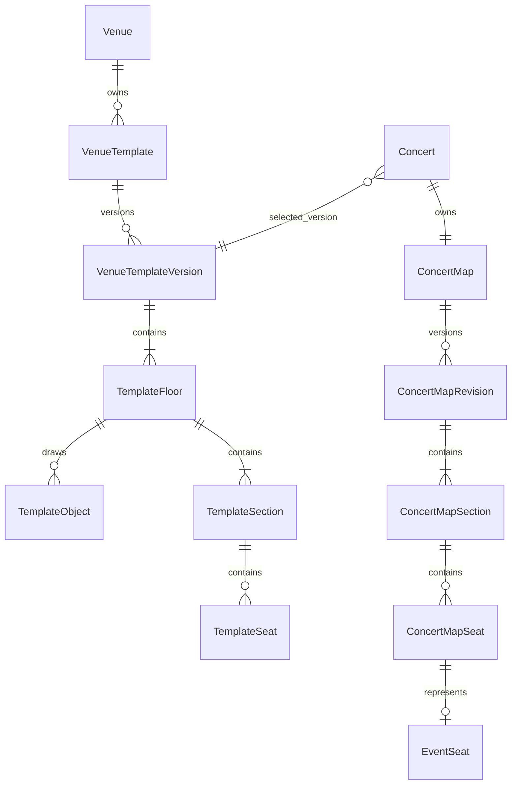

# StagePass — Kiến trúc sơ đồ ghế: đề xuất, hiện trạng, và kế hoạch triển khai

> File này gộp `venue-template-architecture.md` (đề xuất kiến trúc gốc) và
> `stagepass-current-state-and-cutover.md` (nghiên cứu hiện trạng + ánh xạ chuyển đổi)
> thành một tài liệu duy nhất, cộng thêm **Phần D — kế hoạch triển khai chi tiết**.
> Nội dung Phần 1–4 giữ nguyên văn hai file gốc, không diễn giải lại.

---

# PHẦN 1 — QUYẾT ĐỊNH KIẾN TRÚC (đề xuất gốc)

## Quyết định kiến trúc

StagePass nên dùng **venue template có phiên bản bất biến**. Một venue có thể có nhiều
template, như `End stage`, `Theatre` hoặc `In-the-round`; mỗi template có nhiều
version. Admin dựng Draft từ floor plan và publish version. Organizer chỉ chọn version
Published của đúng venue. Khi chọn template, concert tạo map revision Draft; revision
được snapshot và khóa khi concert OnSale.

Giá, ticket category, hold, availability và thay đổi riêng của show nằm ở snapshot
concert. Template gốc không bị sửa. Đây là năng lực vận hành tương đương các hệ thống
lớn, không sao chép giao diện, nhãn hiệu, hình minh họa hay tài sản độc quyền của
Ticketmaster/Eventbrite.

## Kết quả nghiên cứu

Ticketmaster mô tả event template là nơi lưu seat map, giá, offer và attraction để tái
sử dụng; công cụ của họ cho chỉnh floor layout, section và inventory trực quan.
Eventbrite tách venue map/reserved seating khỏi event: organizer chọn hoặc tạo venue map
trước, rồi gắn ticket type vào tier/section.

Nguồn chính thức: [Ticketmaster: template và floor editing](https://business.ticketmaster.com/3-key-features-for-simple-event-creation/), [Ticketmaster: event template](https://business.ticketmaster.com/improve-your-day-to-day-with-ticketmasters-event-creation-tool/), [Eventbrite: reserved seating](https://www.eventbrite.com/features/reserved-seating/), và [Eventbrite: tạo reserved-seating event](https://www.eventbrite.com/help/en-us/articles/454462/how-to-create-a-reserved-seating-event-on-eventbrite-music/).

Do đó phải tách ba lớp:

1. Bản vẽ venue: tài sản vận hành, tái sử dụng được.
2. Cấu hình concert: giá, hold, availability và thay đổi chỉ của show đó.
3. Giao diện khách mua vé: chỉ đọc snapshot đã khóa, không đọc template đang sửa.

## Khoảng cách với hệ thống hiện tại

Chuỗi hiện có `Venue → Zone → Seat → EventSeat` là đúng: `EventSeat` là inventory theo
concert. Tuy nhiên map public đang đọc geometry trực tiếp từ `Venue`, `Zone`, `Seat`.
Model hiện chỉ biểu đạt rectangle/rotation; đổi stage, zone hoặc cải tạo venue có thể
làm concert cũ hiển thị theo layout mới. Nó cũng không biểu đạt được lối đi, shape vòng
cung, bàn, ban công, khu khuyết hay shape theo bản vẽ. Không giải quyết bằng cách thêm
thêm tọa độ vào `Zone`.

## Mô hình dữ liệu đích

`Venue`, `Zone`, `Seat`, `Concert`, `EventSeat` tiếp tục là dữ liệu nghiệp vụ. Các bảng
mới là lớp đồ họa và snapshot; `EventSeat` vẫn là nguồn sự thật về giá và availability.



| Bảng | Nội dung và quy tắc |
| --- | --- |
| `VenueTemplate` | Identity ổn định: venue, tên template, trạng thái `Active/Archived`. Một venue có nhiều template. |
| `VenueTemplateVersion` | `VersionNumber`, status `Draft/Published/Retired`, author, publish time, `rowversion`. Chỉ Draft sửa được; Published là bất biến. |
| `TemplateFloor` | `FloorKey`, tên, thứ tự, canvas riêng, background asset. Các tầng không chồng lên nhau trên một canvas. |
| `TemplateObject` | Stage, aisle, wall, entrance, restroom, bar, text/icon; geometry và z-index. |
| `TemplateSection` | Section có polygon/path, mã và tên ổn định; không giới hạn rectangle. |
| `TemplateSeat` | `SeatKey`, `SeatID` là identity inventory hiện có, row, number, geometry chính xác, accessible/companion flags. SeatID có thể biểu diễn ghế cố định hoặc một vị trí ghế trong cấu hình production; không được coi mặc định là chiếc ghế vật lý cố định. Row generator phải materialize thành ghế khi publish. |
| `ConcertMap` | Root một-một với Concert; giữ identity của map concert. |
| `ConcertMapRevision` | Nguồn template version, revision number, trạng thái `Draft/Locked/Replaced`, thời điểm snapshot. Chỉ một revision có thể được dùng để bán. |
| `ConcertMapRevisionFloor/Object/Section/Seat` | Bản sao map khách thấy; có source ID để truy vết nhưng không phụ thuộc source sau khi snapshot. |

`ConcertMapSeat` chứa `SeatID` và map đến một `EventSeat` chỉ khi ghế được đưa vào bán.
Mỗi `SeatID` chỉ được xuất hiện một lần trong một template version và một lần trong một
concert-map revision. Không để `Concert` trỏ thẳng template rồi đọc template lúc
checkout. Điều này bảo toàn ticket PDF, refund, check-in và báo cáo nếu venue phát hành
version mới.

`GeometryJson` dùng format nội bộ có version: rectangle, polygon, path, circle. Backend
validate geometry. Không render SVG upload tùy ý: phải sanitize và loại script/external
reference; an toàn hơn là rasterize floor plan thành PNG/WebP nền, còn lớp tương tác do
StagePass tạo.

### Ràng buộc tích hợp với schema hiện tại

Trong database hiện tại, `EventSeat` có foreign key đến `Seat`; `Seat` lại thuộc `Zone`
và `Venue`. Vì vậy không thể chỉ thêm bảng đồ họa rồi coi `TemplateSeat` là một ghế mới
độc lập. Với lộ trình chuyển đổi an toàn, `TemplateSeat.SeatID` phải tham chiếu identity
inventory hiện có, còn `ConcertMapSeat` sao chép chính `SeatID`, nhãn và geometry tại
thời điểm tạo revision. Các ghế production tạm thời cũng phải được materialize thành
SeatID trước khi bán; không tạo SeatID lúc khách checkout.

Stored procedure thay thế `sp_AddEventSeats` sẽ nhận `ConcertMapSeatID` thay vì SeatID
thô, sau đó trong **cùng transaction** kiểm tra map revision thuộc concert, map cùng
venue, SeatID cùng venue và chưa có EventSeat trước khi insert. Điều này giữ nguyên quy
tắc EventSeat hiện có, đồng thời chặn organizer gắn một SeatID ngoài map hoặc từ venue
khác vào concert. Zone/Seat geometry hiện tại được coi là legacy trong giai đoạn cutover;
public map phải đọc revision, không đọc geometry legacy.

## Luồng vận hành

### Dựng template một lần

1. Admin chọn venue, tạo template và Draft `v1`.
2. Upload bản vẽ mặt bằng cho từng tầng. Hệ thống tạo asset bất biến, preview, thumbnail
   và content hash.
3. Studio hiển thị bản vẽ làm background; admin kéo-thả stage, aisle, section, nhãn và
   POI. Không bắt admin nhập X/Y.
4. Ghế tạo bằng row tool, curved row tool, table tool, import CSV,
   duplicate/mirror/rotate, sau đó gán row/seat label.
5. Client báo ngay khi thao tác tạo overlap cấm; server kiểm tra lại khi save để chống
   bypass và race condition.
6. Validate kiểm tra: ngoài canvas, polygon tự cắt, overlap, seat key trùng, seat ngoài
   section, aisle bị che, section rỗng và capacity không khớp.
7. Chỉ template không có lỗi mới Publish. Sửa tiếp tạo `v2` từ `v1`, không sửa trực tiếp
   bản đã publish.

### Tạo concert và cấu hình inventory

1. Organizer tạo concert, API chỉ trả template Published của đúng venue.
2. Chọn version sẽ tạo ConcertMapRevision ở trạng thái Draft. Organizer tạo ticket
   category và chọn section/ghế trên map để thêm inventory trong transaction.
3. Giá, hold và offer hiện bằng legend/màu. Capacity và doanh thu dự kiến cập nhật ngay
   khi chọn.
4. Trước OnSale, validate mọi `EventSeat` có map-seat hợp lệ, category active, price và
   sale window đầy đủ. Concert có thể Published trong lúc cấu hình; chỉ khi OnSale mới
   khóa ConcertMapRevision đang chọn.
5. Khi OnSale, API public chỉ đọc revision Locked và trạng thái `EventSeat`; tải overview
   theo floor/section trước, chỉ tải ghế khi khách mở section.

Không thay đổi vị trí một `EventSeat` đã Booked. Thay đổi hình học sau khi revision đã
Locked phải tạo event-map revision Draft kế tiếp và cần audit/lifecycle riêng; revision
mới không thay thế revision đang OnSale khi còn vé, hold hoặc booking hiệu lực. Sau
OnSale chỉ nên cho phép block/unblock theo chính sách rõ ràng.

## Onboard một venue mới

Venue mới không cần có sẵn trong thư viện. Quy trình vận hành là:

1. Admin tạo record Venue ở trạng thái setup và thu nhận bản vẽ được venue cho phép sử
   dụng: một file cho mỗi tầng, kèm tên section, hàng/ghế, stage, aisle, lối vào và khu
   accessible nếu có.
2. Admin tạo VenueTemplate, ví dụ Theatre layout, rồi tạo Draft v1. Bản vẽ là nền để
   dựng object, section shape, hàng và ghế trực quan.

### Bản vẽ mặt bằng lấy từ đâu

Nguồn ưu tiên là **venue owner hoặc đội vận hành venue**: hồ sơ kiến trúc/CAD, PDF mặt
bằng, bản seating manifest, sơ đồ thoát hiểm và layout vận hành hiện hành. Với một show
có stage hoặc sàn ghế thay đổi, promoter/production manager cung cấp thêm **event
production layout**; đây là đầu vào cho một template khác hoặc event-map revision.

Thứ tự nguồn nên dùng:

1. Bản vẽ được phê duyệt của venue/kiến trúc sư: DWG/DXF, Revit export, PDF vector hoặc
   SVG.
2. Seating chart/manifest vận hành đang dùng tại venue, đối chiếu lại với thực địa.
3. Sơ đồ production của tour hoặc đơn vị dựng sân khấu cho từng cấu hình event.
4. Khảo sát hiện trường có đo đạc, ảnh và xác nhận bằng văn bản của venue cho venue nhỏ
   chưa có hồ sơ số.
5. Đơn vị map/CAD được thuê để số hóa bản vẽ đã được venue phê duyệt.

Không dùng ảnh Google, screenshot trang bán vé khác, ảnh quảng cáo hoặc AI sinh ảnh làm
nguồn layout. Chúng có thể sai, không có quyền sử dụng và không đủ độ chính xác để bán
ghế.

StagePass tiếp nhận một asset cho mỗi tầng, kèm metadata: nguồn/cơ quan cung cấp, ngày
hiệu lực, revision, đơn vị tỉ lệ, người xác nhận và quyền sử dụng. DWG/DXF không đưa
thẳng vào browser; backend chuyển đổi có kiểm soát sang PDF/SVG an toàn hoặc PNG/WebP để
làm background. Layer section/seat tương tác vẫn do StagePass lưu riêng và validate; bản
vẽ chỉ là reference layer.

Nếu venue không có bất cứ sơ đồ nào, đội vận hành phải khảo sát rồi ký xác nhận sơ đồ v1
trước khi Publish. Độ chân thật khách mua vé nhận được không thể cao hơn độ tin cậy của
dữ liệu venue cung cấp.

Sau khi bản vẽ đã được xác nhận:

1. Chạy validate, người thứ hai review nếu venue lớn, sau đó publish v1. Từ đây template
   có thể được tái sử dụng cho mọi concert ở venue đó.
2. Organizer tạo concert và chọn v1. Nếu tour diễn có stage khác hoặc bố cục khác, admin
   tạo một template khác, như End-stage v1; không sửa ngược Theatre v1.
3. Khi venue cải tạo, copy version mới nhất sang v2, chỉnh và publish. Concert đã publish
   vẫn giữ snapshot cũ.

Không nên mở bán reserved seating tại một venue chưa có Published template. Có thể cho
phép concert tồn tại ở Draft hoặc Published để nhập thông tin chương trình, nhưng chặn
OnSale đến khi concert có map revision hợp lệ. Khi bổ sung General Admission, venue chưa
có sơ đồ ghế vẫn có thể bán GA qua một GA template đã publish có area/capacity được xác
nhận; không dùng layout giả.

Ở hệ thống hiện tại chỉ có Admin và Organizer. Vì vậy Admin chịu trách nhiệm dựng/publish
template; Organizer chỉ chọn template Published của venue concert mình sở hữu. Nếu sau
này có role Venue Manager, role đó chỉ được quản lý template của những venue được phân
công, còn Organizer vẫn không sửa layout dùng chung.

## Hợp đồng trải nghiệm bản đồ khách mua vé

Luồng bạn mô tả là đúng mục tiêu cho StagePass. Đây là **progressive drill-down**,
không phải một sơ đồ duy nhất được phóng to:

1. **Overview — chọn khu:** khách thấy toàn bộ venue/floor với stage, section label và
   màu availability. Mỗi section là hotspot vector. Nhấn một section mở detail của chính
   section đó; map không tải hàng nghìn ghế ở bước này.
2. **Detail — chọn ghế:** chỉ tải geometry của khu đã chọn và seat status theo thời gian
   thực. Khách pan/zoom, chọn ghế, xem row/seat/price/category và thêm vào giỏ.
3. **Minimap:** cùng hệ tọa độ với overview; nó hiển thị viewport hiện tại bằng một khung
   chữ nhật. Nút Home quay về map tổng quan để chọn khu khác. Minimap là control đồng bộ
   của camera, không phải ảnh trang trí hay nguồn dữ liệu thứ hai.
4. **Quay lại:** Home giữ floor và filter trước đó trên overview, để khách không bị mất
   ngữ cảnh. Không có nút phóng to/thu nhỏ riêng.

### Dữ liệu phục vụ đúng hai cấp

| API | Dữ liệu trả về | Không được trả về |
| --- | --- | --- |
| GET /concerts/{id}/seat-map | snapshot version, floor, stage/object, section path/hotspot, label, availability summary, price range, state | toàn bộ ghế của venue |
| GET /concerts/{id}/seat-map/floors/{floorKey}/sections/{sectionKey} | section geometry, rows/aisles, ghế, accessibility flag, trạng thái, price/category và canonical viewport | ghế ở section/floor khác |
| POST /bookings | nhận public identity của ConcertMapSeat; server resolve EventSeat đúng concert rồi gọi transaction tạo Booking/hold đang có | không tin trạng thái/mức giá do browser gửi |

Overview bắt buộc dùng TemplateSection.GeometryJson/ConcertMapSection.GeometryJson;
detail dùng ConcertMapSeat.GeometryJson. Một section có thể là vòng cung, hình quạt hoặc
shape theo bản vẽ, nên không được suy luận sơ đồ ghế từ rectangle hiện có. Client chỉ
nhận public map-seat identity; Booking API resolve nó về EventSeat trong transaction
hiện có, không để browser chọn EventSeatID tùy ý.

Màu là trạng thái có ý nghĩa, không phải màu trang trí: available, selected,
held/sold/unavailable, accessible và companion phải có legend, tooltip/text thay thế và
độ tương phản đủ dùng. Ghế accessible không chỉ đổi màu mà có shape/icon cùng nhãn đọc
được bằng screen reader. Seat map phải có keyboard/list alternative cho người không thể
thao tác trên canvas; các control chạm cần target đủ lớn. Click vào seat chỉ là chọn cục
bộ; khi gửi Booking backend mới tạo hold atomically, nên màu xanh trên client không phải
xác nhận mua vé.

### Sơ đồ không tự tạo ra "view from seat"

Floor plan chính xác cho biết vị trí tương đối, không tự chứng minh góc nhìn thật, độ
che khuất, âm thanh hay khoảng cách cảm nhận. Nếu StagePass hiển thị "view from seat",
mỗi Section/ConcertMapSeat phải có media ảnh/video/360 hoặc render được venue/production
xác nhận, version, ngày chụp/render và disclosure rõ ràng. Không được nội suy bằng AI
rồi quảng bá là góc nhìn thật.

Các thay đổi production như camera platform, mix position, che khuất hoặc giảm tầm nhìn
là thuộc ConcertMapRevision, không thuộc VenueTemplate chung. Chúng phải có cờ
RestrictedView/ObstructedView, mô tả mua vé, audit và quy tắc không tự di chuyển các
Booking hiện có. Khách phải thấy disclosure trước checkout; pricing/offer có thể phản
ánh restriction đó.

### Collaboration, kiểm thử và release gate

Template editor cần autosave optimistic concurrency ở mức revision, nhưng save một batch
geometry phải all-or-nothing. Khi hai người chỉnh cùng phần tử, server trả conflict với
revision mới nhất; không merge tọa độ tự động. Presence/comment/live cursor chỉ là giai
đoạn sau khi dữ liệu và conflict handling đã ổn định.

Release gate cho mỗi venue-template version gồm: validation topology; kiểm tra liên kết
SeatID; visual-regression với floor plan đã duyệt; test booking cạnh tranh; test
authorization giữa hai organizer; kiểm tra asset độc hại/không được phép; và kiểm thử
keyboard, screen-reader, mobile. Việc chỉ render được map chưa đủ để publish một venue.

### General admission là luồng riêng

Ảnh có vùng GENERAL ADMISSION LAWN. Hệ thống hiện chỉ hỗ trợ ZoneType = Seated, vì vậy
không được giả vờ rằng lawn là một tập ghế. Để hỗ trợ đúng thực tế, cần thêm
EventAdmissionArea/EventAdmissionInventory theo concert: area shape ở overview,
capacity, sold/held/available counter, ticket category và quantity picker. Nhấn một area
GA không đi vào seat-detail mà mở quantity flow. Reserved seating và GA dùng chung
overview, nhưng inventory/hold khác nhau.

### Hiệu năng và tính nhất quán

- Overview trả summary theo section, cache được lâu hơn; status ghế detail có TTL ngắn
  và invalidation sau hold/release/book.
- Detail chỉ render ghế trong viewport; canvas/WebGL hoặc virtualized renderer được dùng
  khi section lớn.
- Viewport là transform client-side trên canonical geometry; minimap không cần endpoint
  thứ hai.
- Khi trạng thái ghế thay đổi trong lúc khách đang chọn, backend trả xung đột/hold
  failure rõ ràng và client làm mới đúng section, không xác nhận theo state cũ.

## API và bảo mật

| Nhóm endpoint | Kiểm tra bắt buộc |
| --- | --- |
| `/admin/venues/{venueId}/templates` | Admin; venue tồn tại. |
| `/admin/template-versions/{id}/validate` và `/publish` | Admin; chỉ Draft; publish transaction và audit. |
| `/admin/template-assets` | Admin; MIME/size limit, virus scan, sanitize/rasterize. |
| `/organizer/venues/{venueId}/published-templates` | Organizer chỉ đọc template Published để chọn. |
| `/organizer/concerts/{id}/map-revisions` | Organizer sở hữu concert; template cùng `Concert.VenueID`. |
| `/organizer/concerts/{id}/map-revisions/{revisionId}/*` | Organizer sở hữu concert; revision còn Draft. |
| `/concerts/{id}/seat-map` | Public, concert sellable; trả overview của revision Locked. |

Mọi lệnh ghi dùng ETag/`rowversion`; xung đột trả `409`, không ghi đè im lặng. Stored
procedure nhận `@ActorUserID`, khóa row concert/template khi publish hay snapshot
(`UPDLOCK, HOLDLOCK`), kiểm tra ownership trong transaction và ghi `AuditRecord`. Chỉ lọc
React hoặc tin `venueId` trên URL là không đủ an toàn.

## Thứ tự triển khai (đề xuất gốc — xem Phần D để có kế hoạch tác nghiệp chi tiết hơn)

### Giai đoạn 0 — Chốt hợp đồng

- Chọn format asset/geometry, giới hạn canvas/số object/số ghế, policy upload, role và
  quy tắc thay đổi sau OnSale.
- Lấy bản vẽ thật của ít nhất ba loại: nhà hát nhiều tầng, arena end-stage,
  ballroom/table. Không thiết kế chỉ từ mock rectangle.
- Viết fixture và acceptance criteria từ các bản vẽ này.

### Giai đoạn 1 — Database và API lõi

- Thêm bảng template/version/floor/object/section/seat/concert-map-revision, foreign
  key, unique key, `rowversion`, soft archive và index truy vấn map.
- Viết stored procedure create draft, save batch, validate, publish, khóa concert
  revision và assign inventory theo section/seat selection.
- Đổi public seat-map query sang revision Locked, giữ contract cũ trong một API version
  để frontend chuyển đổi dần.

### Giai đoạn 2 — Venue Template Studio

- Floor navigator, layer panel, inspector, zoom/pan, snap/ruler, undo/redo, autosave
  debounce và conflict banner.
- Canvas/WebGL cho venue lớn; SVG phù hợp overview/map nhỏ. Culling và virtualization
  tránh tạo hàng chục nghìn DOM node.
- Validation trực tiếp khi kéo thả và validation authoritative ở server.

### Giai đoạn 3 — Concert map

- Chọn template trong concert wizard; preview version; tạo map revision Draft.
- Assign ticket category bằng lasso/brush, section/row selection, bulk action,
  legend/hold, revenue/capacity view và undo transaction.
- Lock lifecycle `Draft → Published → OnSale`; test concurrent assignment/hold.

### Giai đoạn 4 — Customer map và vận hành

- Floor-first overview, section hotspot, lazy seat detail, accessible list alternative,
  mobile pan/zoom và legend rõ ràng.
- Asset CDN/cache theo content hash; inventory status cache ngắn hạn và invalidate khi
  `EventSeat` đổi trạng thái.
- Event-specific blocks, production kills, audit, report theo section.

## Tiêu chí hoàn thành

1. Admin dựng theatre hai tầng từ floor plan mà không nhập tọa độ.
2. Section shape tự do, aisle, stage, tầng, ghế vòng cung/bàn hiển thị đúng và không có
   overlap trái quy tắc.
3. Hai concert dùng cùng `v1`; concert mới dùng `v2`; concert cũ giữ nguyên map lúc
   publish.
4. Organizer A không thể đọc/sửa template draft hoặc concert map của Organizer B.
5. Hai khách giữ cùng một ghế: chỉ một transaction thắng.
6. Map 10.000 ghế vẫn mở nhanh nhờ overview và lazy-load section.
7. Ticket, email, check-in, refund, report luôn trả floor/section/row/seat của snapshot,
   kể cả sau khi venue có version mới.

---

# PHẦN 2 — HIỆN TRẠNG HỆ THỐNG (grounded, đối chiếu trực tiếp mã nguồn)

## 2.1 Lược đồ dữ liệu

**`Venue`** — mặt phẳng + sân khấu, đơn vị số nguyên trừu tượng (không phải mét/pixel):

| Cột | Ràng buộc |
|---|---|
| `MapWidth`, `MapHeight` | cùng NULL hoặc cùng NOT NULL (`CHK_Venue_MapBoxComplete`), đều > 0 |
| `StageX/Y/Width/Height` | cùng NULL hoặc đủ 4 (`CHK_Venue_StageBoxComplete`); cần `MapWidth/Height` trước (`CHK_Venue_StageNeedsMap`); nằm trọn trong mặt phẳng (`CHK_Venue_StageWithinMap`, không âm + không tràn biên) |

**`Zone`** — khu, thuộc một `Venue`:

| Cột | Ràng buộc |
|---|---|
| `ZoneType` | `CHECK (ZoneType = 'Seated')` — **GA đã bị loại bỏ khỏi domain**, không còn là giá trị hợp lệ (không phải chỉ "chưa hỗ trợ trong logic", mà CSDL từ chối ở tầng CHECK) |
| `ZoneX/Y/Width/Height` | cùng NULL hoặc đủ 4 (`CHK_Zone_BoxComplete`); `X,Y >= 0` (`CHK_Zone_PositionNonNegative`) — **không kiểm tra khu nằm trong Venue ở đây**, vì đó là bất biến liên bảng, CHECK không làm được |
| `ZoneRotation` | `(-360, 360)` mở, đơn vị độ |
| `ZoneLevel` | tầng/khán đài, `NULL` hoặc `> 0`; nhiều khu cùng `ZoneLevel` là các vùng vẽ **loại trừ nhau trên cùng một canvas**; khác `ZoneLevel` được phép trùng hình chiếu (ban công trên khán đài) |
| `ZoneCapacity` | `CHECK (ZoneCapacity IS NULL)` — cột còn giữ lại **chỉ để dành chỗ** cho mô hình sức chứa GA sau này, hiện luôn phải NULL |
| `UNIQUE(VenueID, ZoneCode)` | mã khu duy nhất trong địa điểm |

**`Seat`** — ghế, thuộc một `Zone`. Đây là điểm thiết kế quan trọng nhất cần hiểu trước
khi bàn chuyển đổi:

> **Ghế KHÔNG lưu toạ độ tuyệt đối.** Chỉ có `SeatRowLabel` + `SeatColumnNumber` — một
> **ô lưới**, không phải một điểm (x, y). Vị trí hiển thị thực tế = hộp bao của Zone +
> góc xoay + phép nội suy ô lưới, tính **lúc render**, không lưu sẵn. Lý do ghi thẳng
> trong comment của `Seat.sql`: toạ độ tuyệt đối "sẽ sai ngay khi khu được đặt lại vị
> trí, sinh ra hai nguồn sự thật lệch nhau".

| Cột | Ràng buộc |
|---|---|
| `SeatCode` | định danh, **không phải vị trí**; `UNIQUE(ZoneID, SeatCode)` — duy nhất trong khu, không phải toàn Venue |
| `SeatRowLabel`, `SeatColumnNumber` | cùng NULL hoặc cùng NOT NULL (`CHK_Seat_GridComplete`); cột `> 0` |
| `UIX_Seat_GridSlot` | **filtered unique index**: `(ZoneID, SeatRowLabel, SeatColumnNumber) WHERE SeatStatus='Active'` — một ô lưới chỉ một ghế đang hoạt động chiếm; ghế Retired giữ lại vị trí lịch sử mà không chặn ô đó được dùng lại |

**Bất biến đối xứng, thi hành ở SP (không phải CHECK vì liên quan tới bảng khác)**:
khu có ghế (`ZoneType='Seated'`, hiện là loại duy nhất) → **mọi ghế Active bắt buộc có
vị trí**. Không có ngoại lệ "ghế không toạ độ trong khu có ghế" — lý do nêu thẳng
trong code: nếu cho phép, renderer dồn mọi ghế thiếu toạ độ về cùng một ô, chúng chồng
khít lên nhau, người dùng chỉ bấm được đúng một ghế trong khi các ghế còn lại **biến
mất không thông báo**.

**`EventSeat`** — hàng tồn kho theo từng Concert, tách bạch khỏi ghế vật lý:

```
PK EventSeatID · UNIQUE(ConcertID, SeatID) · InventoryStatus ∈
  {Available, OnHold, OnHoldForWaitlist, Booked, Unavailable}
```

Đây chính là ranh giới **StagePass đã đặt tên đúng**: `EventSeat` là "nguồn sự thật
duy nhất về giá và availability" của Phần 1 — thực tế hiện tại khớp 100% với mô tả đó.

## 2.2 Stored procedure dựng/sửa hình học

| SP | Việc chính | Cơ chế đồng thời |
|---|---|---|
| `sp_ConfigureVenueMap` | Đặt `MapWidth/Height` + sân khấu | `SELECT ... WITH (UPDLOCK)` trên dòng `Venue`; chặn thu nhỏ mặt phẳng dưới vùng khu đang chiếm (SAT trên hình xoay); chặn sân khấu chồng khu (SAT); chặn bật/sửa map khi còn `EventSeat` thuộc khu chưa định vị (59830) |
| `sp_CreateZone` / `sp_UpdateZone` | Dựng/sửa khu | Cùng khoá `WITH (UPDLOCK)` trên **đúng dòng Venue** mà `sp_ConfigureVenueMap` khoá — ba SP này tranh chấp trên cùng một tài nguyên nên phải đồng bộ với nhau, không chỉ tự nhất quán riêng lẻ. Kiểm tra: khu nằm trong mặt phẳng (SAT trên hình xoay), khu không chồng sân khấu (SAT), khu không chồng khu khác **cùng `ZoneLevel`** (SAT ba lớp, dùng góc xoay riêng của từng khu) |
| `sp_CreateSeat` / `sp_UpdateSeat` | Dựng/sửa ghế | `UPDLOCK+HOLDLOCK` trên `Seat` để khoá key-range chống hai request cùng tạo trùng mã/trùng ô lưới; bất biến "Active thì phải có vị trí" áp dụng trên **giá trị sau khi hợp nhất PATCH**, không áp cứng nhắc lên từng tham số |
| `sp_CreateSeatsBatch` | Tạo cả lưới ghế trong một transaction | Validate toàn bộ payload (JSON phải là mảng, không rỗng, ≤3600 phần tử, không trùng mã/ô lưới trong chính lô gửi lên) rồi mới chạm CSDL; atomic — lỗi ở ghế bất kỳ rollback toàn bộ lô, không để lại "nửa lưới" |
| `sp_AddEventSeats` | Ghế → hàng tồn kho | Từ chối ghế thuộc khu chưa định vị nếu Venue **đã** bật sơ đồ (58220) — không được để `EventSeat` "biến mất" khỏi renderer SVG dù CSDL vẫn còn hàng |
| `sp_SetEventSeatUnavailable` | Đánh dấu ghế hỏng/giữ đặc biệt | Chỉ chuyển được từ `Available`↔`Unavailable`; không đụng được ghế đang bị Booking chiếm |

**Thuật toán va chạm dùng xuyên suốt** (SAT — Separating Axis Theorem cho hình chữ
nhật đã xoay, **không phải AABB**): tính tâm + nửa-rộng/cao + `sin`/`cos` góc xoay của
cả hai hình, rồi so bốn trục chiếu. Lựa chọn này **có chủ đích** — comment trong code
ghi rõ: dùng AABB thì "khu xoay 45 độ ở sát biên vẫn qua được và bị cắt mất trên SVG".

## 2.3 Trigger bất biến liên bảng

| Trigger | Bất biến | Ghi chú |
|---|---|---|
| `TRG_SeatVenueConsistency` | `Seat.VenueID = Zone.VenueID` của Zone tương ứng | |
| `TRG_EventSeatVenue` | `EventSeat` chỉ trỏ `Seat` thuộc đúng `Venue` của `Concert` | |
| `TRG_ConcertVenueChangeGuard` | Không đổi `Concert.VenueID` khi đã có `EventSeat` | |
| `TRG_SeatVenueChangeGuard` | Không đổi `Seat.VenueID` khi đang bị `EventSeat` tham chiếu | Cùng bảng `Seat` với `TRG_SeatVenueConsistency`; **thứ tự kích hoạt được ghim tường minh** ở `TRG_FiringOrder.sql` vì SQL Server không đảm bảo thứ tự giữa hai AFTER trigger nếu không ghim — đã từng gây một test flaky (xanh lần này, đỏ lần deploy sau) |
| `TRG_AllocationConcert` | `BookingEventSeatAllocation.EventSeatID` phải cùng Concert với `Booking` | |
| `TRG_EventSeatPriceConsistency` | Đổi `TicketCategory.BasePrice` → cascade `EventSeat.SalePrice` toàn bộ ghế cùng hạng | |
| `TRG_InventoryAllocationConsistency` (2 chiều) | Có Allocation Active ⇔ `InventoryStatus ∈ {OnHold, Booked}` | |

## 2.4 Tầng đọc công khai — đúng mô hình "progressive drill-down" Phần 1 đề xuất

Ba endpoint, đã tồn tại và khớp gần như nguyên văn với hợp đồng API mà Phần 1
§"Dữ liệu phục vụ đúng hai cấp" mô tả:

| Endpoint hiện có | Trả về | Ứng với Phần 1 |
|---|---|---|
| `GET /concerts/{id}/seatmap` | Venue (map+stage) + từng Zone kèm `SeatCount/AvailableCount/MinPrice/MaxPrice` — **không** kèm ghế | `GET .../seat-map` (overview) |
| `GET /concerts/{id}/seatmap/zones/{zoneId}` | Ghế của **đúng một khu**: `RowLabel/ColumnNumber/InventoryStatus/Price` | `GET .../floors/{floorKey}/sections/{sectionKey}` (detail) |
| `GET /concerts/{id}/seats` | Danh sách phẳng toàn bộ ghế, có cache Redis TTL 15s | Không có tương đương trực tiếp — dùng cho luồng cũ/kiểm tra nhanh |

`GetSeatMapAsync` dùng `QueryMultipleAsync` lấy **cả ba tầng trong một round-trip
CSDL** — lý do ghi trong code: gọi tách rời sẽ mở ra khoảng hở giữa các lần đọc, sơ đồ
có thể mô tả một trạng thái chưa từng tồn tại thật (khu bị dời vị trí giữa hai lần
đọc). Đây chính là nguyên tắc "snapshot nhất quán" mà Phần 1 yêu cầu ở tầng cao hơn
(snapshot theo `ConcertMapRevision`) — hệ thống hiện tại **đã áp dụng nguyên tắc đó**,
chỉ ở phạm vi hẹp hơn (một lần gọi, không phải một phiên bản bất biến lâu dài).

**Cache** (`SeatMapCache.cs`): TTL 15 giây, khoá chống cache-stampede **chia làn** (64
làn cố định theo hash key, không phải một khoá toàn cục) để cache-miss của concert A
không chặn concert B lúc nhiều sự kiện mở bán cùng lúc. Đọc Redis lỗi → coi là cache
miss, đọc thẳng CSDL — cache là "bộ tăng tốc", không phải nguồn sự thật, nên Redis chết
không được làm ngừng luồng mua vé (từng tái hiện được lỗi ngược lại, đã sửa).

## 2.5 Tầng admin — API ghi

`AdminController` expose CRUD Venue/Zone/Seat qua `sp_*` tương ứng, cộng route đọc
`GET /admin/venues`, `GET /admin/venues/{id}/zones`, `GET /admin/zones`,
`GET /admin/seats` (đọc CSDL thật, không qua sổ tay `localStorage` — xem
`adminCatalog.js`/`AdminRepository.Catalog.cs`).

## 2.6 Frontend — cả hai màn đã tồn tại và đã tinh vi hơn dự đoán ban đầu

**`SeatMap.jsx`** (khách xem) — **SVG nội tuyến thuần**, không Canvas/WebGL:

- Mức 1 vẽ Zone dạng `<rect>` xoay bằng `transform="rotate(...)"`, tô màu theo
  `availableCount` (còn chỗ/hết chỗ), bấm → tải mức 2.
- Mức 2 vẽ ghế trong **hệ toạ độ riêng của khu** (không phải hệ toạ độ Venue) — vị trí
  từng ghế **tính lại ở client** từ `rowLabel`/`columnNumber` bằng ô lưới cố định
  44 đơn vị, khớp đúng chủ ý thiết kế "ghế không lưu toạ độ tuyệt đối" ở tầng CSDL.
- Đã có sẵn: `aria-label` đầy đủ theo từng ghế (khu, hàng, ghế, giá, trạng thái),
  điều hướng bàn phím (`Enter`/`Space` chọn, `Escape` quay lại tổng quan), vùng đọc
  trạng thái `aria-live`, sơ đồ thu nhỏ (`compact` overview) giữ phương hướng khi đang
  xem chi tiết một khu đã xoay thẳng để dễ bấm.

**`VenueMap.jsx`** (admin dựng sơ đồ) — đã có phần lớn "Giai đoạn 2 — Venue Template
Studio" mà Phần 1 mô tả, **chỉ thiếu lớp phiên bản/snapshot**:

- Trình biên tập kéo-thả bằng con trỏ thật (`onPointerDown/Move/Up`), không phải form
  nhập số: vẽ vùng, di chuyển, đổi kích thước (tay cầm góc), xoay (nút ±5°).
- **Kiểm tra va chạm client-side y hệt thuật toán server** (`overlapsGeometry` trong
  `VenueMap.jsx` là bản JavaScript của đúng phép SAT trong `sp_CreateZone.sql`) — xem
  trước ngay khi kéo, tô đỏ nếu chồng lấn, **chỉ ghi khi thả chuột và preview hợp lệ**.
  Đây đúng nguyên văn yêu cầu của Phần 1: "Client báo ngay khi thao tác tạo overlap
  cấm; server kiểm tra lại khi save để chống bypass và race condition."
- Snap lưới 10 đơn vị (`snap()`), tự kẹp trong biên mặt phẳng kể cả khi xoay
  (`fitGeometry` tính lại `extentX/Y` từ góc xoay trước khi kẹp).
- Chọn tầng (`ZoneLevel`) để chỉ vẽ/tương tác đúng một canvas — khớp
  "Floor navigator" của Phần 1.
- Bước 3 sinh lưới ghế hàng loạt bằng `sp_CreateSeatsBatch`, tự đặt tên hàng kiểu
  bảng chữ cái (A, B, … Z, AA, AB…) và mã ghế theo `{ZoneCode}-{Row}{Col}`.
- "Bản xem trước" (`Preview`) là component riêng, vẽ **đúng như trang khách sẽ thấy** —
  cùng nguồn dữ liệu, khác chỗ hiển thị; đây là hình thức thô sơ của
  "visual-regression với floor plan đã duyệt" mà Phần 1 liệt vào release gate.

## 2.7 Đã kiểm chứng bằng thực nghiệm, không chỉ bằng đọc code

File `database/Tests/14_Test_VenueMap_Concurrency.ps1` dựng lại đúng race điều kiện
giữa `sp_ConfigureVenueMap` và `sp_CreateZone`/`sp_UpdateZone`: một kết nối tự giữ
`UPDLOCK` trên dòng Venue bằng T-SQL thô (mô phỏng bước đầu của SP), kết nối thứ hai
gọi **đúng SP thật, không sửa gì** — xác nhận bằng `sys.dm_exec_requests.wait_type`
rằng kết nối thứ hai **bị khoá chờ thật sự**, không đọc được giá trị cũ đã lạc hậu.
Đây là bằng chứng thực nghiệm cho lớp phòng thủ mà kiến trúc StagePass gọi là
"conflict handling" ở tầng cao hơn — cơ chế nền hiện tại là **khoá bi quan
(pessimistic locking qua UPDLOCK)**, không phải optimistic concurrency/ETag.

---

# PHẦN 3 — ÁNH XẠ CHUYỂN ĐỔI: HIỆN TẠI → STAGEPASS

| Hiện tại | StagePass đề xuất | Loại thay đổi |
|---|---|---|
| `Venue.MapWidth/Height/StageX/Y/W/H` | `TemplateFloor` (canvas riêng từng tầng) + `TemplateObject` (stage là một loại object) | **Tổng quát hoá**: một mặt phẳng duy nhất → nhiều tầng, mỗi tầng một canvas |
| `Zone` (hình chữ nhật xoay) | `TemplateSection` (polygon/path tự do) | **Tổng quát hoá hình học**: rect+rotation → polygon bất kỳ. Thuật toán SAT cho rect **không dùng lại nguyên vẹn được** — cần thuật toán va chạm polygon lồi tổng quát (SAT tổng quát trên trục pháp tuyến của từng cạnh, hoặc thư viện hình học tính toán) |
| `Seat` (ô lưới, không toạ độ tuyệt đối) | `TemplateSeat` (`geometry chính xác`, theo Phần 1) | **Thay đổi mô hình dữ liệu cơ bản nhất**: hiện tại cố ý KHÔNG lưu toạ độ tuyệt đối (để tránh hai nguồn sự thật lệch nhau khi khu bị dời). Phần 1 yêu cầu toạ độ chính xác cho ghế cong/bàn tròn. Hai cách dung hoà — xem §4.2 |
| Không có versioning | `VenueTemplateVersion` (`Draft/Published/Retired`) | **Hoàn toàn mới**: CSDL hiện tại không có khái niệm phiên bản cho bất kỳ đối tượng nào |
| Không có snapshot theo Concert | `ConcertMapRevision` + `...Floor/Object/Section/Seat` | **Hoàn toàn mới**, nhưng **nguyên tắc đã có tiền lệ**: `GetSeatMapAsync` đọc cả ba tầng trong một round-trip chính là để tránh y hệt vấn đề mà snapshot giải quyết ở phạm vi rộng hơn |
| `UPDLOCK` bi quan trên dòng Venue | ETag/`rowversion`, xung đột trả 409 | **Đổi mô hình đồng thời**: từ khoá-chờ sang phát-hiện-xung-đột. Không tương thích ngược đơn giản — xem §4.4 |
| `sp_AddEventSeats(@SeatIDs)` | nhận `ConcertMapSeatID` | SP mới phải **giữ nguyên** toàn bộ kiểm tra hiện có (58219 Retired, 58220 chưa định vị, 58217 trùng) cộng thêm kiểm tra revision/venue khớp |
| `ZoneType='Seated'` (CHECK cứng) | `TemplateSection` + `EventAdmissionArea` riêng cho GA | Gỡ bỏ constraint `CHK_Zone_Type` hiện tại là bước cần làm SAU KHI mô hình GA mới đã có, không phải trước — nếu gỡ trước, dữ liệu hiện tại chưa có gì xử lý GA sẽ rơi vào trạng thái không xác định |
| `SeatMap.jsx` render lưới từ `rowLabel`/`columnNumber` | Render `GeometryJson` (polygon/path) | Nếu giữ được `TemplateSeat.GeometryJson` **tối giản về đúng lưới hàng-cột khi không cần hình dạng đặc biệt**, phần lớn logic vẽ hiện tại (tô màu theo `InventoryStatus`, `aria-label`, điều hướng bàn phím) **dùng lại được gần như nguyên vẹn** — chỉ đổi nguồn toạ độ |

---

# PHẦN 4 — CÁC TRƯỜNG HỢP TRIỂN KHAI CẦN PHỦ ĐẦY ĐỦ

## 4.1 Cutover: venue đã có dữ liệu thật, concert đang bán vé

Phần 1 (dòng tương ứng "Khi venue cải tạo, copy version mới nhất sang v2") nói tới việc
cải tạo, nhưng **chưa trả lời**: venue **hiện tại đang hoạt động** (có
`Zone`/`Seat`/`EventSeat` thật, có `Booking` đã `Confirmed`) chuyển sang mô hình
template thế nào, mà không làm gián đoạn concert đang bán.

Kịch bản bắt buộc phải phủ, theo đúng tinh thần "concert cũ giữ nguyên map lúc publish"
(tiêu chí hoàn thành #3 của Phần 1):

1. **Sinh `VenueTemplateVersion v1` tự động từ dữ liệu `Zone`/`Seat` hiện có** của mỗi
   Venue, đúng một lần, qua một job migration — không phải Admin vẽ lại tay. Với
   `Zone` có hình chữ nhật, `TemplateSection.GeometryJson` là rect đó y nguyên (polygon
   4 đỉnh suy ra từ `ZoneX/Y/Width/Height/Rotation`). Với `Seat`, vì không có toạ độ
   tuyệt đối, `TemplateSeat.GeometryJson` tính bằng đúng công thức nội suy ô lưới mà
   `SeatMap.jsx` đang làm ở client hiện nay (44-đơn-vị mỗi ô) — **di chuyển logic đó từ
   client sang job migration**, không phát minh công thức mới.
2. **Concert đang OnSale tại thời điểm cutover** phải nhận `ConcertMapRevision` snapshot
   từ `v1` sinh ra ở bước 1, đánh dấu `Locked` ngay (không phải `Draft`) — vì với concert
   đã bán vé, "Draft" không có nghĩa: không còn ai được sửa hình học của nó nữa.
3. **`EventSeat` hiện có giữ nguyên `SeatID`** (không đổi khoá) — chỉ thêm cột
   `ConcertMapSeatID` trỏ tới dòng snapshot mới sinh, để không phải viết lại lịch sử vé
   đã phát hành (`Ticket`, `CheckIn`, `Refund` đều trỏ xuyên qua `EventSeat`/`Booking`,
   không trỏ thẳng `Seat`).
4. **API public đổi nguồn đọc trong cùng một lần deploy** (`Zone`/`Seat` trực tiếp →
   `ConcertMapRevision*`), nhưng **giữ nguyên hợp đồng JSON trả về** — vì §2.4 đã
   chỉ ra hợp đồng hiện tại gần như trùng khớp Phần 1, không cần đổi contract, chỉ đổi
   nguồn. Đây là lý do nên tách "Giai đoạn 1" thành hai bước nhỏ hơn: (1a) thêm bảng
   mới + migration snapshot mà **không đổi API**, (1b) đổi nguồn đọc của API sau khi đã
   xác nhận snapshot khớp 100% dữ liệu cũ bằng script đối chiếu tự động.

## 4.2 Vấn đề "ghế không toạ độ tuyệt đối" — quyết định kiến trúc chưa được nêu ra

Đây là khoảng cách sâu nhất giữa hiện tại và Phần 1, và **Phần 1 chưa đối mặt nó**. Hai
lựa chọn thật, có đánh đổi ngược nhau:

**Lựa chọn 1 — Giữ suy luận vị trí từ lưới, chỉ generalize khi cần.**
`TemplateSeat` mặc định vẫn chỉ lưu `(rowKey, columnIndex)` + tham chiếu `TemplateSection`;
`GeometryJson` **tuỳ chọn**, chỉ set khi ghế nằm trên hàng cong/bàn tròn — nơi phép nội
suy lưới thẳng không áp dụng được. Ưu điểm: giữ nguyên bất biến "một nguồn sự thật" mà
`Seat.sql` đã lập luận kỹ (vị trí luôn tính lại từ hộp bao Section, không bao giờ lệch
khi Section bị dời). Nhược điểm: hàng cong/bàn tròn cần một hàm nội suy phức tạp hơn
44-đơn-vị-mỗi-ô hiện tại (nội suy dọc theo path, không phải lưới vuông góc).

**Lựa chọn 2 — Theo đúng Phần 1: `TemplateSeat.GeometryJson` luôn là toạ độ chính xác.**
Ưu điểm: đơn giản, mọi hình dạng ghế đều biểu diễn được như nhau. Nhược điểm: **đánh
đổi đúng thứ mà thiết kế hiện tại cố tình tránh** — sửa `TemplateSection` (dời, xoay,
đổi kích thước) không tự động cập nhật toạ độ ghế bên trong nữa; cần một bước "re-flow"
tường minh (tính lại toạ độ mọi `TemplateSeat` con) mỗi khi Section chứa nó bị sửa, và
bước đó phải nằm trong cùng transaction với việc sửa Section — nếu không, có một
khoảng thời gian ghế "trôi" ra khỏi khu chứa nó, đúng loại lỗi mà `UPDLOCK` đồng bộ
Zone↔Venue hiện tại được viết ra để chặn.

**Khuyến nghị**: Lựa chọn 1, vì nó kế thừa được nguyên vẹn lý do thiết kế đã kiểm chứng
của hệ thống hiện tại, và chỉ mở rộng đúng phạm vi cần (hàng cong/bàn tròn), không viết
lại bất biến đã đúng. **Phần D áp dụng lựa chọn này làm nền cho toàn bộ kế hoạch.**

## 4.3 Ghế đã Booked khi Section chứa nó cần sửa hình học

Phần 1 nói "Không thay đổi vị trí một `EventSeat` đã Booked." Nhưng không nói **hệ
thống phát hiện việc này thế nào khi Section được sửa**, trong khi hiện tại vị trí
ghế suy ra từ Section — sửa Section tức là **âm thầm** đổi vị trí hiển thị của mọi ghế
bên trong, kể cả ghế đã bán.

Phủ đủ trường hợp này cần: sửa `TemplateSection` (hình dạng/vị trí, không phải nhãn)
**không được phép** khi phiên bản Section đó đang được một `ConcertMapRevision` ở
trạng thái `Locked` tham chiếu **và** revision đó còn `Booking`/`Ticket` hiệu lực — đúng
khuôn với luật đã có thật hôm nay: `sp_UpdateZone` từ chối Retire một Zone đang có
`EventSeat` trong kho vé của Concert chưa kết thúc (lỗi 59415), và
`sp_ConfigureVenueMap` từ chối cả việc bật/sửa map khi có `EventSeat` thuộc khu chưa
định vị (59830). Luật mới chỉ là mở rộng đúng nguyên tắc đó sang tầng Version thay vì
tầng Venue/Zone trực tiếp.

## 4.4 Chuyển từ UPDLOCK sang ETag — không làm cả hệ thống cùng lúc

Phần 1 yêu cầu "Mọi lệnh ghi dùng ETag/`rowversion`". Hệ thống hiện tại **không
có cột `rowversion` ở bất kỳ đâu** — toàn bộ 43 SP dùng khoá bi quan
(`UPDLOCK`/`HOLDLOCK`), đã kiểm chứng đúng đắn và có test thực nghiệm (§2.7).

Trộn lẫn hai mô hình trong cùng một transaction là nguồn lỗi tinh vi: một SP giữ
`UPDLOCK` trên `Venue` trong khi một SP khác cùng lúc kiểm `rowversion` của
`VenueTemplateVersion` có thể tạo deadlock chéo mô hình mà không cơ chế nào trong hai
bên "nhìn thấy" bên kia. Khuyến nghị tách rõ ranh giới: **API ghi hình học vật lý gốc
(Venue/Zone/Seat, dùng cho Admin dựng template) tiếp tục UPDLOCK như hiện tại** — đây
là thao tác hiếm, một Admin một lúc, không cần đồng thời cao; **API mới cho
`VenueTemplateVersion`/`ConcertMapRevision` (nơi có collaboration nhiều người, đúng
kịch bản "hai người chỉnh cùng phần tử" của Phần 1) mới dùng ETag** — vì optimistic
concurrency đúng chỗ khi xung đột hiếm nhưng cần phản hồi nhanh cho nhiều người dùng
cùng sửa.

## 4.5 Tương thích ngược cho `SeatMap.jsx`/`VenueMap.jsx` trong giai đoạn chuyển tiếp

Vì cutover không thể xảy ra tức thời cho mọi Venue cùng lúc (§4.1), hệ thống cần
chạy đồng thời **cả hai nguồn dữ liệu** trong một khoảng thời gian: Venue đã migrate
đọc từ `ConcertMapRevision`, Venue chưa migrate vẫn đọc thẳng `Zone`/`Seat` như hôm nay.
`GetSeatMapAsync`/`GetSeatMapZoneAsync` cần một nhánh rẽ theo việc Venue có
`VenueTemplateVersion` Published hay không — **và học đúng nguyên tắc "0 dòng = fail
closed"** đã dùng nhất quán trong toàn hệ thống (các view RLS `VW_Admin*` hiện tại):
Venue nửa vời (có template nhưng chưa Published) phải rơi về hành vi cũ, không rơi vào
trạng thái không xác định.

## 4.6 Kiểm thử — mở rộng theo đúng khuôn test đã có, không phát minh khuôn mới

Bộ test hiện tại đã có ba mẫu trực tiếp áp dụng được cho StagePass mà không cần thiết
kế lại cách viết test:

1. **Test đồng thời kiểu `14_Test_VenueMap_Concurrency.ps1`** (hai connection thật,
   đồng bộ qua `sys.dm_exec_requests`, gọi SP thật không sửa đổi) — dùng nguyên khuôn
   này cho xung đột ETag: connection A giữ một `VenueTemplateVersion` ở trạng thái
   đang sửa, connection B gọi API publish với `rowversion` cũ, xác nhận nhận đúng 409
   chứ không phải ghi đè im lặng.
2. **Test cô lập giữa hai Organizer**, khuôn `OwnedCatalogs_..._AndDenyOtherIdentities`
   (đã có trong `AdminCatalogRepositoryTests.cs`) — áp trực tiếp cho tiêu chí hoàn
   thành #4 của Phần 1 ("Organizer A không thể đọc/sửa template draft hoặc concert map
   của Organizer B").
3. **Test SQL kiểu `sp_RunTest` với `BEGIN TRAN/ROLLBACK`** cho từng nhánh lỗi hình học
   mới (polygon tự cắt, section rỗng, seat ngoài section) — đúng khuôn 226 test đang
   chạy, mỗi luật một `THROW` mã riêng, mỗi mã một dòng test `'ERROR', <code>`.

---

# PHẦN D — KẾ HOẠCH TRIỂN KHAI CHI TIẾT, CHUYÊN BIỆT

> Mục tiêu của phần này: biến Phần 1–4 thành một roadmap **có thể giao việc được**,
> từng bước gắn với tên bảng/SP/file thật đã xác định trong Phần 2, không mô tả chung
> chung. Đây vẫn là **tài liệu kế hoạch**, không phải code — đúng phạm vi đã thống nhất.

## D.0 Nguyên tắc chỉ đạo xuyên suốt kế hoạch

1. **Không phá vỡ hệ thống đang chạy.** Mọi giai đoạn phải giữ được `dotnet test` (222
   unit + 79 integration) và bộ test SQL (226 test) xanh liên tục — không có giai đoạn
   nào được phép "tạm thời đỏ rồi sửa sau".
2. **Song song, không thay thế đột ngột.** Áp dụng đúng §4.5: hai nguồn dữ liệu cùng tồn
   tại trong giai đoạn chuyển tiếp, chọn theo từng Venue, không theo một cờ toàn cục.
3. **Mỗi bất biến mới phải có tiền lệ trong bất biến cũ.** Không phát minh cơ chế lạ với
   hệ thống — chỗ nào Phần 4 đã chỉ ra tiền lệ (59415, 59830, `UIX_Seat_GridSlot`,
   `sp_RunTest`, `14_Test_VenueMap_Concurrency.ps1`…) thì dùng lại đúng khuôn đó.
4. **Ưu tiên theo giá trị chứng minh được**, không theo thứ tự liệt kê trong Phần 1.
   Thứ tự dưới đây khác thứ tự "Giai đoạn 0–4" gốc ở chỗ: tách nhỏ Giai đoạn 1 thành
   hai bước không đổi API trước, để mỗi bước đều **verify được độc lập** bằng cách so
   sánh dữ liệu cũ/mới, thay vì đổi tất cả rồi mới biết đúng hay sai.

## D.1 Quyết định kiến trúc phải chốt bằng văn bản trước khi viết dòng code đầu tiên

Đây là "Giai đoạn 0" của Phần 1, cụ thể hoá thành các quyết định có thể sai nếu bỏ qua:

| Quyết định | Chọn | Lý do (tham chiếu Phần 4) |
|---|---|---|
| Mô hình toạ độ ghế | **Lựa chọn 1** — lưới hàng/cột mặc định, `GeometryJson` tuỳ chọn cho hàng cong/bàn tròn | §4.2 |
| Mô hình đồng thời | **UPDLOCK** cho Venue/Zone/Seat vật lý gốc; **ETag/rowversion** chỉ cho `VenueTemplateVersion`/`ConcertMapRevision` | §4.4 |
| Thứ tự đổi API | **Không đổi contract** `GET .../seatmap`, `.../seatmap/zones/{id}` — chỉ đổi nguồn đọc phía sau | §2.4, §4.1 bước 4 |
| Format polygon | Dùng cùng hệ đơn vị trừu tượng hiện tại (số nguyên, không phải mét/pixel) để `TemplateFloor` tương thích `Venue.MapWidth/Height` khi migrate | §4.1 bước 1 |
| Thuật toán va chạm mới | SAT tổng quát cho polygon lồi (không tái dùng nguyên công thức rect hiện tại, nhưng **giữ nguyên chiến lược**: client preview bằng đúng thuật toán server, không phải một bản "gần đúng" riêng cho UI) | §2.6 (VenueMap.jsx), Phần 1 §"Client báo ngay" |
| GA (General Admission) | **Ngoài phạm vi giai đoạn 1–4** — chỉ làm sau khi reserved-seating cutover ổn định; không gỡ `CHK_Zone_Type` trước | Phần 3 hàng cuối |

## D.2 Giai đoạn 1a — Thêm bảng + snapshot, KHÔNG đổi API (dữ liệu mới chạy song song, im lặng)

**Việc cụ thể:**

- Thêm 9 bảng theo đúng sơ đồ ERD Phần 1: `VenueTemplate`, `VenueTemplateVersion`,
  `TemplateFloor`, `TemplateObject`, `TemplateSection`, `TemplateSeat`, `ConcertMap`,
  `ConcertMapRevision`, `ConcertMapRevisionFloor/Object/Section/Seat` (gộp hoặc tách
  theo Floor/Object/Section/Seat — quyết định lúc thiết kế DDL chi tiết).
  `VenueTemplateVersion` và `ConcertMapRevision` có cột `rowversion` (D.1).
- Viết SP mới, **đặt tên theo đúng quy ước đang dùng** (`sp_<Verb><Entity>`):
  `sp_CreateVenueTemplate`, `sp_CreateVenueTemplateVersion`,
  `sp_SaveTemplateFloorBatch`, `sp_ValidateVenueTemplateVersion`,
  `sp_PublishVenueTemplateVersion`, `sp_CreateConcertMapRevision`,
  `sp_LockConcertMapRevision`. Mỗi SP giữ nguyên khuôn hiện có: `@ActorUserID` đầu
  tiên, `BEGIN TRY/BEGIN TRANSACTION`, kiểm quyền bằng `UserRoleAssignment` JOIN
  `Role`, ghi `AuditRecord` cuối cùng, `THROW <mã mới>` cho từng nhánh lỗi.
- **Cấp mã lỗi mới trong dải chưa dùng** — Phần 2 §2.2 cho thấy dải `598xx`/`599xx` đã
  gần kín (59801–59833); dùng dải mới, ví dụ `600xx` cho template/version,
  `601xx` cho concert-map-revision, để không trùng và dễ tra cứu.
- **Job migration một lần** (script, không phải SP nghiệp vụ): với mỗi `Venue` có
  `MapWidth` NOT NULL, sinh `VenueTemplate` + `VenueTemplateVersion v1 Published` +
  `TemplateFloor` (1 tầng nếu chưa phân tầng, hoặc theo từng `ZoneLevel` phân biệt) +
  `TemplateSection` (từ `Zone`, polygon 4 đỉnh suy từ hộp bao xoay) + `TemplateSeat`
  (từ `Seat`, toạ độ suy bằng đúng công thức 44-đơn-vị của `SeatMap.jsx`). Với mỗi
  `Concert` đang `OnSale`/`SaleClosed`/`Completed` có `EventSeat`, sinh
  `ConcertMapRevision Locked` snapshot từ `v1` tương ứng.
- **Script đối chiếu tự động**: so `COUNT(*)`, tổng toạ độ trung tâm, và danh sách
  `SeatCode` giữa `Zone`/`Seat` gốc và `TemplateSection`/`TemplateSeat` sinh ra — chạy
  như một test SQL độc lập (`15_Test_StagePass_MigrationParity.sql`, khuôn `sp_RunTest`
  hiện có), không merge vào Giai đoạn 1b nếu chưa xanh 100%.

**Không đổi**: `AdminController`, `ConcertController`, `SeatMap.jsx`, `VenueMap.jsx` —
tất cả vẫn đọc/ghi `Zone`/`Seat` như hôm nay. Giai đoạn này **chỉ tạo dữ liệu bản sao**,
rủi ro production gần như bằng không vì không đường nào trong ứng dụng đọc bảng mới.

**Tiêu chí xong**: `15_Test_StagePass_MigrationParity.sql` xanh trên toàn bộ dữ liệu
demo hiện có; job migration chạy lại lần hai không tạo trùng lặp (idempotent, theo
đúng nguyên tắc `IF NOT EXISTS` mà `SeedData.sql` đang dùng).

## D.3 Giai đoạn 1b — Đổi nguồn đọc của API public, giữ nguyên contract

**Việc cụ thể:**

- `ConcertRepository.GetSeatMapAsync`/`GetSeatMapZoneAsync`: thêm nhánh — nếu Venue có
  `VenueTemplateVersion Published` **và** Concert có `ConcertMapRevision Locked`, đọc
  từ bảng mới; ngược lại giữ nguyên câu SQL hiện tại (§4.5, fail-closed về hành vi cũ).
- `SeatDto`/`SeatMapDto`/`SeatMapZoneDetailDto` (trong `DTOs/Dtos.cs`) **không đổi
  field** — chỉ đổi câu SQL nguồn, đúng cam kết D.1.
- Test: `AdminCatalogHttpTests.cs`/`AdminCatalogRepositoryTests.cs` mở rộng thêm case
  "Venue đã migrate trả cùng kết quả với Venue chưa migrate cho cùng một bộ dữ liệu" —
  chạy cả hai nhánh trên cùng một fixture, so JSON response byte-for-byte.

**Tiêu chí xong**: `GET /concerts/{id}/seatmap` trả kết quả **giống hệt** trước và sau
khi Venue được migrate (test tự động xác nhận), không có consumer nào (frontend) cần
sửa.

## D.4 Giai đoạn 2 — Venue Template Studio: mở rộng `VenueMap.jsx`, không viết lại

Vì §2.6 đã xác nhận phần lớn UI/UX cần thiết đã có, việc ở giai đoạn này là **tổng quát
hoá**, không phải xây mới:

- `ZoneLayoutEditor` (component vẽ/kéo/xoay hiện tại) đổi input từ 4 tham số hình chữ
  nhật (`x, y, width, height, rotation`) sang mảng đỉnh polygon — công cụ vẽ thêm chế
  độ "vẽ đa giác" (click từng đỉnh, đóng đa giác) bên cạnh chế độ "vẽ hình chữ nhật"
  hiện có (giữ lại, vì đa số khu vẫn là chữ nhật và không cần ép người dùng vẽ tay).
- `overlapsGeometry` (SAT cho rect) → thêm `overlapsPolygon` (SAT tổng quát trên trục
  pháp tuyến từng cạnh của cả hai đa giác) — **viết cả hai phiên bản client (JS) và
  server (T-SQL) từ cùng một đặc tả thuật toán**, đúng nguyên tắc D.1 hàng "Thuật toán
  va chạm mới".
- Thêm màn chọn `VenueTemplate`/`VenueTemplateVersion` phía trên `VenueMap.jsx` hiện
  tại (hiện chỉ chọn thẳng Venue) — Draft mới kế thừa toạ độ từ Published gần nhất
  (nút "Sao chép từ v_N" thay vì bắt vẽ lại từ đầu, đúng luồng "copy version mới nhất
  sang v2" của Phần 1).
- `SeatGridForm` (Bước 3 hiện có) giữ nguyên cho trường hợp lưới thẳng; thêm "công cụ
  hàng cong" chỉ khi Section được vẽ dạng polygon không phải chữ nhật — sinh
  `TemplateSeat.GeometryJson` bằng nội suy dọc theo cạnh polygon (đây là phần việc kỹ
  thuật mới thật sự, không tái dùng được code cũ).

**Tiêu chí xong**: Admin dựng lại được đúng một trong ba bản vẽ thật đã thu thập ở D.1
(nhà hát nhiều tầng, arena end-stage, hoặc ballroom/table — theo Phần 1 "Giai đoạn 0"),
publish được, và `15_Test_StagePass_MigrationParity.sql`-style so sánh xác nhận preview
khớp bản vẽ đã duyệt.

## D.5 Giai đoạn 3 — Concert Map: gắn inventory vào revision

- `AddEventSeatsAsync`/`sp_AddEventSeats` giữ nguyên tên, đổi tham số nhận
  `@ConcertMapSeatIDs` thay vì `@SeatIDs` khi Concert dùng revision mới (nhánh rẽ theo
  D.3); toàn bộ kiểm tra hiện có (58217 trùng, 58219 Retired, 58220 chưa định vị) áp
  dụng y nguyên, cộng kiểm tra mới "ConcertMapSeat thuộc đúng revision của Concert".
- UI: `Concerts.jsx` (màn "Đưa ghế vào kho vé") thêm chế độ chọn theo Section (lasso)
  khi Concert dùng revision mới — tái dùng `ZoneSeats` (component vẽ ghế trong
  `SeatMap.jsx`) làm nền chọn, không viết renderer thứ hai.

## D.6 Giai đoạn 4 — Customer map: mở rộng `SeatMap.jsx`

- `VenueOverview`/`ZoneSeats` đổi nguồn hình học sang `GeometryJson` khi có, **giữ
  nguyên fallback lưới hàng/cột hiện tại khi không có** (đúng D.1 — Lựa chọn 1 không hy
  sinh đường cũ).
- Giữ nguyên toàn bộ lớp accessibility đã có (`aria-label`, bàn phím, `aria-live`) —
  đây là phần **không cần làm lại**, chỉ cần đảm bảo `GeometryJson` polygon vẫn tính
  được tâm hình để đặt text nhãn đúng chỗ.
- **Không làm "view from seat"** trong phạm vi kế hoạch này — Phần 1 đã nêu rõ yêu cầu
  xác thực nguồn (ảnh/video có venue xác nhận, ngày chụp) vượt quá phạm vi một đồ án;
  để lại như một mục "ngoài phạm vi" tường minh, không âm thầm bỏ qua.

## D.7 Kiểm thử & release gate — áp dụng §4.6, liệt kê file cụ thể

| Lớp test | File cụ thể | Nội dung |
|---|---|---|
| Migration parity | `database/Tests/15_Test_StagePass_MigrationParity.sql` | Đối chiếu `Zone`/`Seat` gốc với `TemplateSection`/`TemplateSeat` sinh ra |
| Đồng thời phiên bản | `database/Tests/16_Test_StagePass_VersionConcurrency.ps1` | Khuôn `14_Test_VenueMap_Concurrency.ps1`: hai connection, xác nhận 409 khi `rowversion` cũ |
| Cô lập Organizer | Mở rộng `AdminCatalogRepositoryTests.cs` | Thêm case cho `ConcertMapRevision`, cùng khuôn `OwnedCatalogs_..._AndDenyOtherIdentities` |
| Validate hình học | `database/Tests/17_Test_StagePass_TemplateValidation.sql` | Một `THROW` mã mới cho mỗi luật: polygon tự cắt, section rỗng, seat ngoài section, aisle bị che |
| Tương thích ngược API | Mở rộng `AdminCatalogHttpTests.cs` | So JSON response Venue-cũ vs Venue-đã-migrate |
| Booking cạnh tranh trên revision mới | Mở rộng khuôn `11_Test_Concurrency.sql` | Hai khách giữ cùng `ConcertMapSeat` → đúng một thắng |

## D.8 Rollout & rollback

- **Theo từng Venue**, không theo cờ toàn cục: `VenueTemplateVersion Published` tồn tại
  hay không **chính là** feature flag tự nhiên (§4.5) — không cần bảng cấu hình riêng.
- **Rollback D.2/D.3**: xoá `VenueTemplateVersion`/`ConcertMapRevision` của đúng Venue
  đó; API tự rơi về nhánh đọc cũ vì nhánh rẽ đã kiểm tra "Published tồn tại hay không".
  Không cần rollback schema (bảng mới không ảnh hưởng bảng cũ, không có trigger nào từ
  bảng cũ trỏ sang bảng mới).
- **Không rollback được** sau D.5 (đã gắn `EventSeat` thật vào `ConcertMapSeat` và có
  `Booking` mới trên đó) — vì vậy D.5 chỉ bật cho Concert **mới tạo sau ngày cutover**
  của đúng Venue đó, không áp hồi tố lên Concert đang bán.

## D.9 Ước lượng độ lớn tương đối (không phải lịch trình — dùng để sắp ưu tiên)

| Giai đoạn | Độ lớn | Rủi ro | Có thể làm độc lập, không chặn phần còn lại? |
|---|---|---|---|
| D.1 Quyết định kiến trúc | S | Thấp (không code) | — |
| D.2 Bảng mới + migration song song | M | Thấp (không đụng đường sống) | Có |
| D.3 Đổi nguồn đọc API | S–M | Trung bình (sai sót lộ ra ở production đọc) | Không — cần D.2 xong |
| D.4 Studio polygon | L | Trung bình (thuật toán hình học mới) | Có, sau D.2 |
| D.5 Concert map + inventory | L | Cao (đụng luồng bán vé thật) | Không — cần D.3 và D.4 |
| D.6 Customer map polygon | M | Thấp (có fallback) | Có, sau D.4 |
| D.7 Test toàn diện | M | — | Chạy song song mọi giai đoạn |
| GA (ngoài phạm vi) | XL | Cao | Sau toàn bộ, riêng biệt |

**Khuyến nghị tuần tự nếu nguồn lực hạn chế** (đúng bối cảnh đồ án — một người, có kỳ
hạn): D.1 → D.2 → D.3 dừng lại ở đây đã là một cột mốc trình bày được ("hệ thống có
snapshot bất biến theo phiên bản, kiểm chứng bằng script đối chiếu tự động, không đổi
một dòng API công khai nào") — D.4 trở đi là hướng phát triển tiếp theo, không bắt buộc
để chứng minh kiến trúc đúng.

## D.10 Phạm vi cố ý bỏ ngoài kế hoạch này

Nêu tường minh, không im lặng bỏ qua — đúng kỷ luật đã dùng xuyên suốt các tài liệu
trước:

- **General Admission** (§D.1 hàng cuối) — cần mô hình inventory theo sức chứa hoàn
  toàn khác `EventSeat`, xứng đáng một kế hoạch riêng.
- **"View from seat"** (§D.6) — vượt phạm vi vì đòi hỏi quy trình xác thực nguồn media
  không có trong hệ thống hiện tại.
- **Canvas/WebGL cho venue >10.000 ghế** — hiện tại SVG nội tuyến đã đủ cho quy mô demo;
  chỉ cần khi có venue thật lớn, và là một thay thế renderer cục bộ, không ảnh hưởng
  lược đồ dữ liệu ở Phần D.
- **Asset CDN/pipeline chuyển đổi DWG/DXF** — cần dịch vụ ngoài (chuyển đổi định dạng
  CAD), không phải việc của riêng StagePass; để nguyên là "nhận file đã chuyển đổi sẵn"
  trong phạm vi D.1–D.7.
- **Role Venue Manager** — Phần 1 đã tự nêu "nếu sau này có" — giữ nguyên là dự phòng,
  không thiết kế trước khi có nhu cầu thật.
